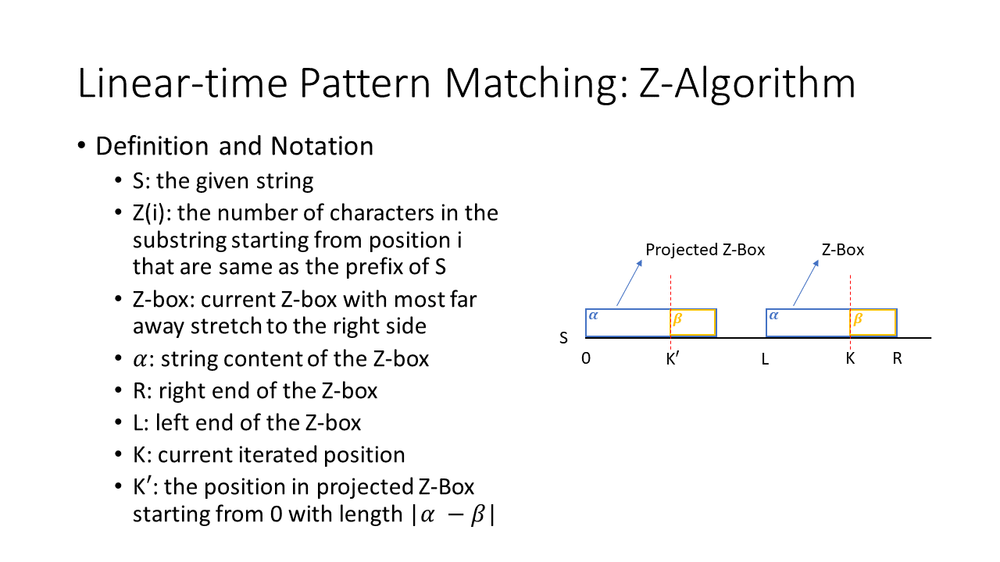
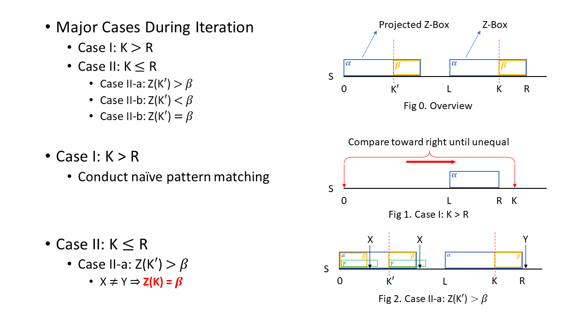
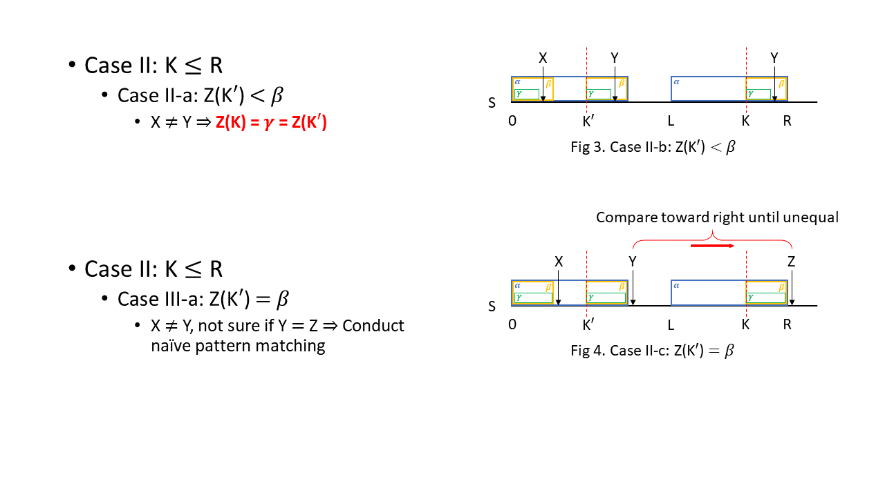

**String**
---
## Pattern Matching
### Z-algorithm: a linear time algorithm

  

  

  

#### Reference
* UC Davis **CS122a - Algorithm Design and Analysis**, by *Dan Gusfield*
    * [Youtube Video Part 1](https://www.youtube.com/watch?v=MFK0WYeVEag&t=43s) 
    * [Youtube Video Part 2](https://www.youtube.com/watch?v=NVJ_ELSbbew&t=907s)

**Basic Sub-topics**
---
| # | Sub-topic | Classic Examples |
|---| --------- | ---------------- |
|1|Patten matching| [Z algorithm](pattern_match/Z_algorithm.cpp), [Longest Happy Prefix](pattern_match/longest_happy_prefix.cpp)