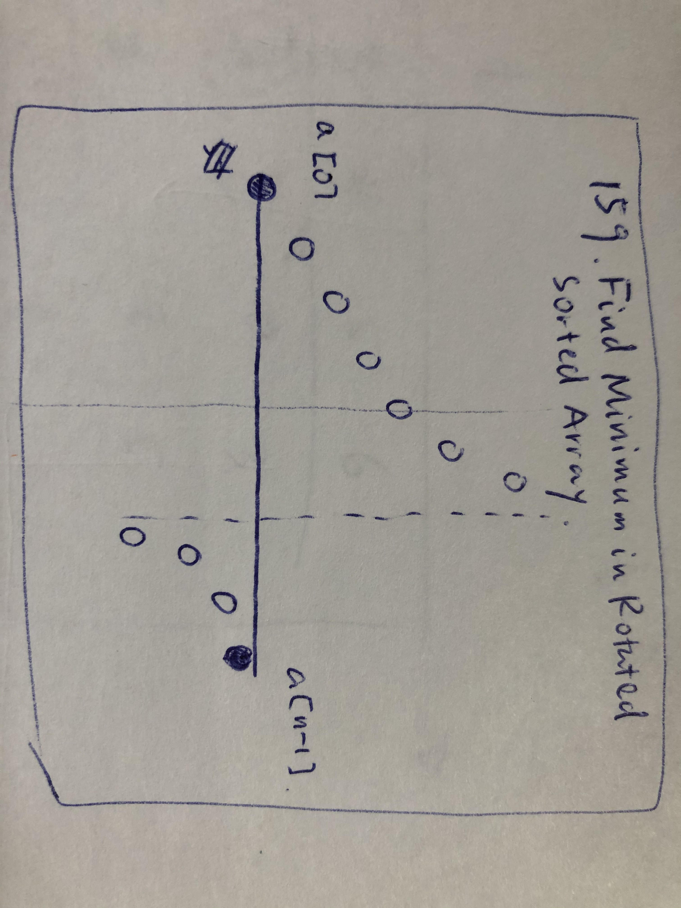
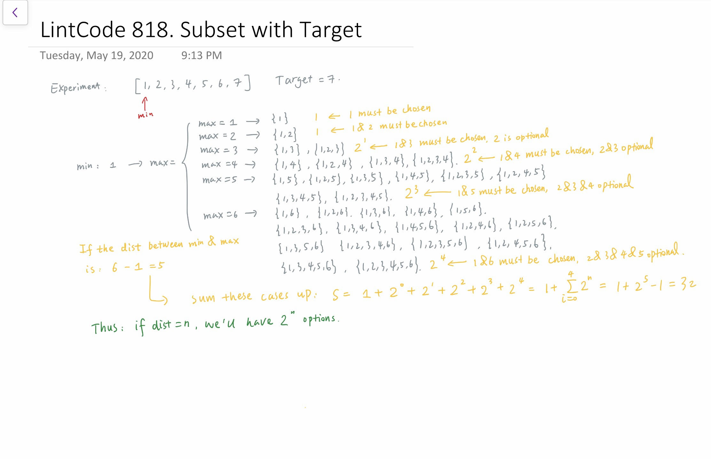
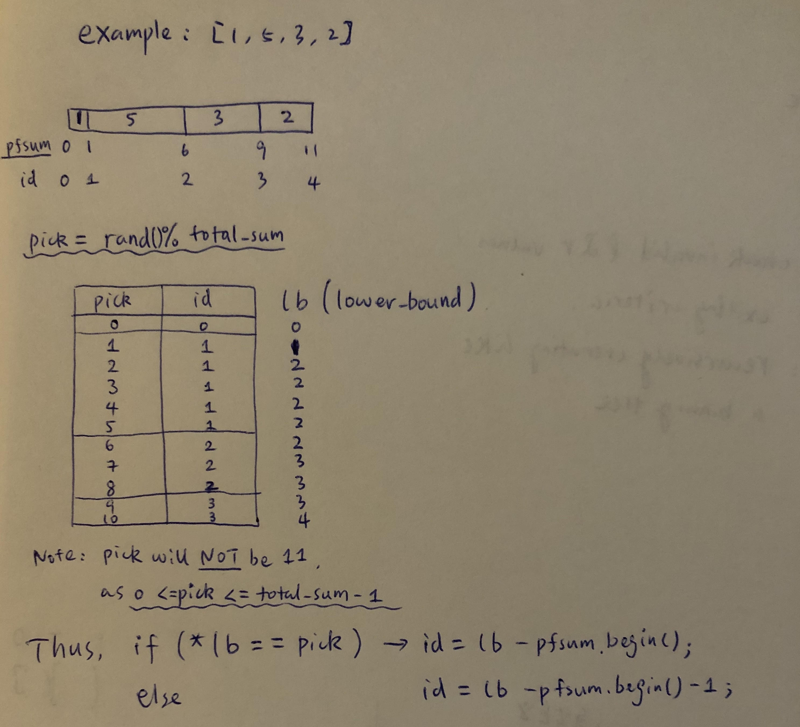

# Binary Search

## Type 1: Binary Search for Answers

### LinkCode 617: Maximum Average Subarray II

_\[A Very Classic Question\]_

Given an array with positive and negative numbers, find the `maximum average subarray` which length should be greater or equal to given length `k`.


 It's guaranteed that the size of the array is greater or equal to _k_.


#### Example

Example 1:

```text
Input:
[1,12,-5,-6,50,3]
3
Output:
15.667
Explanation:
 (-6 + 50 + 3) / 3 = 15.667
```

Example 2:

```text
Input:
[5]
1
Output:
5.000
```

#### Logic:

* We are going to find whether **an attempting answer** `T` ****will be **feasible**, which is the essential intuition of _**Binary Search for Answers**_
* Say we aim to find if `T` is feasible, then within `j - i + 1 >= k`, we shall have:

$$
\frac{a_i + ... + a_j}{j+i-1} = \frac{\sum_{n=i}^{j} a_n }{ j-i+1} \geq T
$$

* According to the equation above, if we subtract `T` on both sides:

$$
\frac{(a_i - T)+ ... + (a_j - T)}{j+i-1} = \frac{\sum_{n=i}^{j} (a_n-T) }{ j-i+1} \geq 0
$$

* Now denote `b[i] = a[i] - T`, then within `j - i + 1 >= k`, we wish to find the **maximum subarray sum**:

$$
b_i + ... + b_j= \sum_{n=i}^{j} b_n \geq 0
$$

* This can be easily achieved by using prefix sum:
  * If we can find the maximum subarray sum &gt;= 0, attemption is successful
  * Otherwise the attemption is failed
  * In detail, check the equation below to calculate `MaxSubarraySum[i]`, and finally get the maximum one among `k<= i <= n`:

$$
MaxSubarraySum_i=S_i - min(S_0, S_1, ..., S_{i-k+1})
\\
where, S_i \triangleq S_0 + S_1 + ... + S_{i-1}
$$

* Note, how to determine the answers' `start` and `end` choices?
  * Since `start` is the minimum average, which is the minimum value among the array
  * Similarly, `end` shall be the maximum value among the array

#### Sample code:


```cpp
class Solution {
public:
    // Note: the essential process is based on "double" type
    bool isTValFeasible(vector<int>& nums, int n, int k, double T)
    {
        // def: pfsum[k] = a[0] + a[1] + ... + a[k-1]
        vector<double> pfsum(n+1, 0.0);
        
        for (int i = 0; i < n; i++)
            pfsum[i+1] = pfsum[i] + nums[i] - T;

        double min_pfval = pfsum[0]; // minimum pfsum value beyond k distance to i
        // this strategy guarantees that there're at least k elements' sum
        for (int i = k; i <= n; i++)
        {
            min_pfval = min(min_pfval, pfsum[i-k]);
            double possible_max_val = pfsum[i] - min_pfval;
            
            if (possible_max_val >= 0)
                return true;
        }
        return false;
    }
    /**
     * @param nums: an array with positive and negative numbers
     * @param k: an integer
     * @return: the maximum average
     */
    double maxAverage(vector<int> &nums, int k) {
        // write your code here
        int start = INT_MAX, end = INT_MIN;
        int n = nums.size();

        for (int i = 0; i < n; i++)
        {
            start = min(start, nums[i]);
            end   = max(end,   nums[i]);
        }

        double thres = 0.00001;
        double s = start, e = end;
        while (e - s > thres)
        {
            double mid = s + (e - s) / 2;
            if (isTValFeasible(nums, n, k, mid))
                s = mid;
            else
                e = mid;
        }
        
        return s;
    }
};
```


## Type 2: Rotated Arrays

### LintCode 159: Find Minimum in Rotated Sorted Array

Suppose a sorted array in ascending order is rotated at some pivot unknown to you beforehand.

\(i.e., `0 1 2 4 5 6 7` might become `4 5 6 7 0 1 2`\).

Find the minimum element.


 You can assume no duplicate exists in the array.


**Example 1:**

```text
Input：[4, 5, 6, 7, 0, 1, 2]
Output：0
Explanation：
The minimum value in an array is 0.
```

**Example 2:**

```text
Input：[2,1]
Output：1
Explanation：
The minimum value in an array is 1.
```

#### Logic:

* Always compare to the front value `a[0]` and end value `a[n-1]`
* A corner case: there's NO rotation in the given array, then just simply return `a[0]`



#### Sample code:


```cpp
class Solution {
public:
    /**
     * @param nums: a rotated sorted array
     * @return: the minimum number in the array
     */
    int findMin(vector<int> &nums) {
        int n = nums.size();
        if (n == 1)
            return nums[0];
        int start = 0, end = n - 1;
        
        // corner case: if there's no rotation, return nums[0]
        if (nums[0] < nums[n-1])
            return nums[0];

        while (start + 1 < end)
        {
            int mid = (start + end) / 2;
            
            if (nums[mid] >= nums[0])
                start = mid;
            else if (nums[mid] <= nums[n-1])
                end = mid;
            // otherwise, nums[mid] < nums[0] && nums[mid] > nums[n-1], impossible
        }

        if (nums[start] < nums[end])
            return nums[start];
        else
            return nums[end];
    }
};
```


### 

### LintCode 160: Find Minimum in Rotated Sorted Array II

#### Note: 

* The reason to put this item here is that, IT **CANNOT** BE ACHIEVED BY BINARY SEARCH
  * It can be proved \(according to jiuzhang course\) that the worse case TC is O\(N\), such as, "111110111", only one 0 among all 1s
  * On the cases where `a[0] > a[n-1]`, one can apply binary search

#### Sample code:


```cpp
class Solution {
public:
    /**
     * @param nums: a rotated sorted array
     * @return: the minimum number in the array
     */
    int findMin(vector<int> &nums) {
        int n = nums.size();
        if (n == 1)
            return nums[0];
        int start = 0, end = n - 1;
        
        // corner case: if there's no rotation, return nums[0]
        if (nums[0] < nums[n-1])
            return nums[0];
        
        // only in this case, we can use binary search ( TC: O(logN) )
        if (nums[0] > nums[n-1])
        {
            while (start + 1 < end)
            {
                int mid = (start + end) / 2;
                
                if (nums[mid] >= nums[0])
                    start = mid;
                else if (nums[mid] <= nums[n-1])
                    end = mid;
                // otherwise, nums[mid] < nums[0] && nums[mid] > nums[n-1], impossible
            }
    
            if (nums[start] < nums[end])
                return nums[start];
            else
                return nums[end];
        }
        else // just simply search everyone ( TC: O(N) )
        {
            int min_val = nums[0];
            for (int i = 0; i < n; i++)
                min_val = min(min_val, nums[i]);
                
            return min_val;
        }
        
    }
};
```


## Type 3: Binary Search for Ranges in Arrays

### LintCode 818. Subset with Target

Give an array and a target. We need to find the number of subsets which meet the following conditions:  
The sum of the minimum value and the maximum value in the subset is less than the target.

* The length of the given array does not exceed `50`.
* `target <= 100000`.

**Example 1**

```text
Input:
array = [1,5,2,4,3]
target = 4
Output: 2
Explanation: Only subset [1],[1,2] satisfy the condition, so the answer is 2.
```

**Example 2**

```text
Input:
array = [1,5,2,4,3]
target = 5
Output: 5
Explanation: Only subset [1],[2],[1,3],[1,2],[1,2,3] satisfy the condition, so the answer is 5.
```

#### Logic:

* Sort, and find the relation by trying some experiments



#### Sample code:


```cpp
class Solution {
public:
    /**
     * @param nums: the array
     * @param target: the target
     * @return: the number of subsets which meet the following conditions
     */
    long long subsetWithTarget(vector<int> &nums, int target) {
        sort(nums.begin(), nums.end());
        
        int n = nums.size();
        long long res = 0;
        for (int i = 0; i < n; i++)
        {
            int min_val_option = nums[i];
            int max_val_option = target - min_val_option;
            auto lb = lower_bound(nums.begin(), nums.end(), max_val_option);
            // lb is the first/smallest one >= max_val_option, thus -1 is needed
            int max_pos_option = lb - nums.begin() - 1; 
            if (max_pos_option >= i)
                res += pow(2, max_pos_option - i);
            else
                break;
        }
        
        return res;
    }
};
```


### LeetCode 275. H-index II

Given an array of citations **sorted in ascending order** \(each citation is a non-negative integer\) of a researcher, write a function to compute the researcher's h-index.

According to the [definition of h-index on Wikipedia](https://en.wikipedia.org/wiki/H-index): "A scientist has index h if h of his/her N papers have **at least** h citations each, and the other N − h papers have **no more than** h citations each."

**Example:**

```text
Input: citations = [0,1,3,5,6]
Output: 3 
Explanation: [0,1,3,5,6] means the researcher has 5 papers in total and each of them had 
             received 0, 1, 3, 5, 6 citations respectively. 
             Since the researcher has 3 papers with at least 3 citations each and the remaining 
             two with no more than 3 citations each, her h-index is 3.
```

**Note:**

If there are several possible values for _h_, the maximum one is taken as the h-index.

**Follow up:**

* This is a follow up problem to [H-Index](https://leetcode.com/problems/h-index/description/), where `citations` is now guaranteed to be sorted in ascending order.
* Could you solve it in logarithmic time complexity?

#### Logic:

* Clearly we need to use the binary search here, but how to make it smooth? At each comparison, think in this way: 
  * Apparently, people normally pursue **higher H-index.** Thus, at first, propose number of qualified papers, which is defined as `num` in the code, and calculated by `num = n - mid`. Now, we can judge this proposal by comparing `citations[mid]` and `num`.
  * Case I: `citations[mid] >= num`. In this case, all the right side citations are even larger than or equal to`citations[mid]`, so the proposal `num` is valid \(refer to the definition of H-index\), i.e., the H-index of this person must be larger than or equal to`num`. Therefore, all the smaller H-index proposals will not be we need to check the left side proposals. Thus, `r = mid`.

#### Sample Code:


```cpp
class Solution {
public:
    int hIndex(vector<int>& citations) {
        int n = citations.size();
        if (n == 0) return 0;
        
        // binary search
        int l = 0, r = n - 1;
        while (l + 1 < r) {
            int mid = (l + r) / 2;
            int num = n - mid; // a proposal of h_index
            if (citations[mid] >= num) {
                // all the candidates of H-index from right side will be too small
                r = mid;
            } else {
                // all the candidates left side will be invalid, because they are even smaller
                l = mid;
            }
        }
        
        if (citations[l] >= n - l) return n - l;
        else if (citations[r] >= n - r) return n - r;
        else return n - r - 1;
    }
};
```


## Type 4: Lowerbound related Questions

### LeetCode 528. Random Pick with Weight

Given an array `w` of positive integers, where `w[i]` describes the weight of index `i`, write a function `pickIndex` which randomly picks an index in proportion to its weight.

Note:

1. `1 <= w.length <= 10000`
2. `1 <= w[i] <= 10^5`
3. `pickIndex` will be called at most `10000` times.

**Example 1:**

```text
Input: 
["Solution","pickIndex"]
[[[1]],[]]
Output: [null,0]
```

**Example 2:**

```text
Input: 
["Solution","pickIndex","pickIndex","pickIndex","pickIndex","pickIndex"]
[[[1,3]],[],[],[],[],[]]
Output: [null,0,1,1,1,0]
```

**Explanation of Input Syntax:**

The input is two lists: the subroutines called and their arguments. `Solution`'s constructor has one argument, the array `w`. `pickIndex` has no arguments. Arguments are always wrapped with a list, even if there aren't any.

#### Logic:

* It's easy to figure out use `pfsum` and `lower_bound` to solve it
* An important detail: `res = *lb == pick ? lb - pfsum.begin() : lb - pfsum.begin() - 1;`
  * `lower_bound` finds the **smallest value** that is **larger than or equal** **to** the target
  * the answer \(index\) we want to find is **"left closed, right open"** range
  * Check the example for reference



#### Sample Code:


```cpp
class Solution {
public:
    vector<int> pfsum;
    int total_sum = 0;
    Solution(vector<int>& w) {
        int n = w.size();
        pfsum.assign(n+1, 0);
        for (int i = 0; i < n; i++) {
            pfsum[i+1] = w[i] + pfsum[i]; 
        }
        total_sum = pfsum[n];
    }
    int pickIndex() {
        int pick = rand() % total_sum;
        auto lb = lower_bound(pfsum.begin(), pfsum.end(), pick);
        int index = lb - pfsum.begin();
        if (*lb > pick) index--;
        return index;
    }
};

/**
 * Your Solution object will be instantiated and called as such:
 * Solution* obj = new Solution(w);
 * int param_1 = obj->pickIndex();
 */
```


