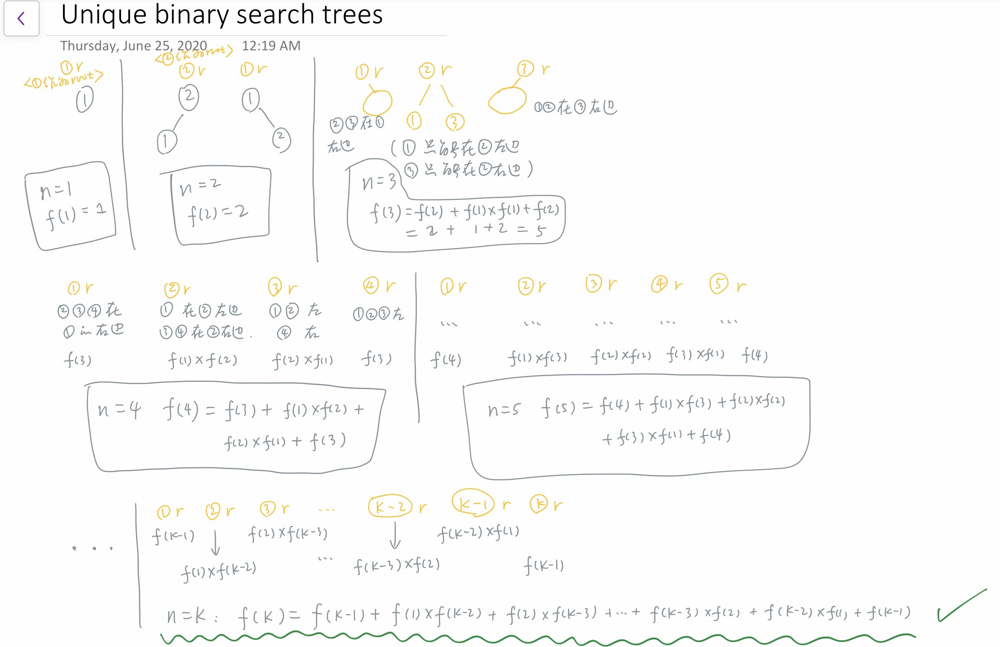
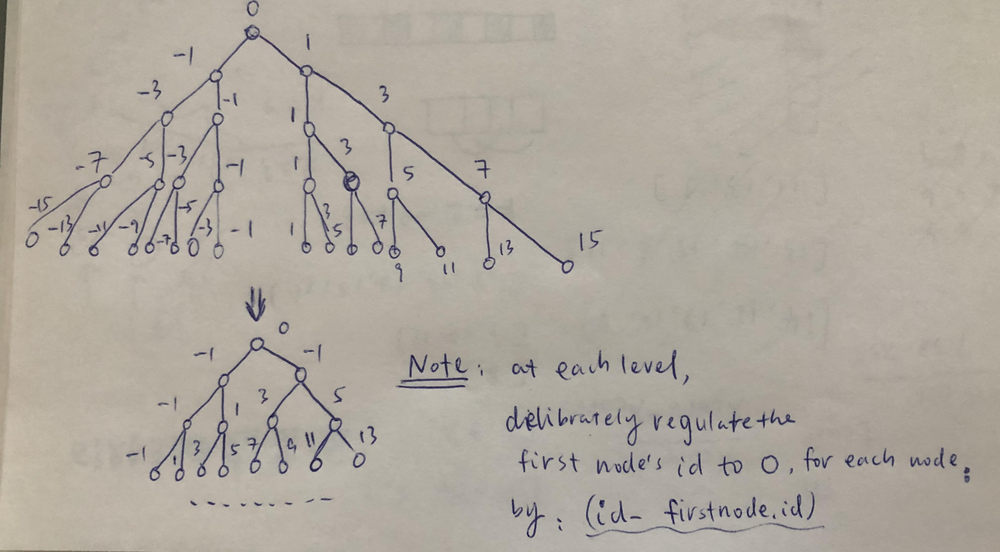
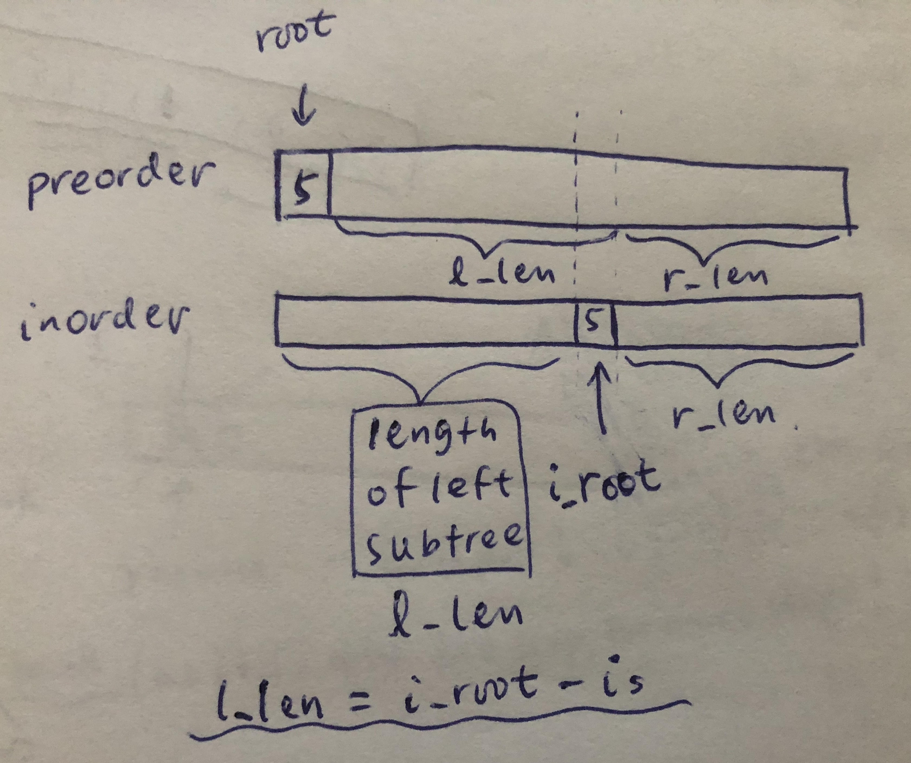

# Binary Tree

## Type 1: Path Sum

### LeetCode 124. Binary Tree Maximum Path Sum

Given a **non-empty** binary tree, find the maximum path sum.

For this problem, a path is defined as any sequence of nodes from some starting node to any node in the tree along the parent-child connections. The path must contain **at least one node** and does not need to go through the root.

**Example 1:**

```text
Input: [1,2,3]

       1
      / \
     2   3

Output: 6
```

**Example 2:**

```text
Input: [-10,9,20,null,null,15,7]

   -10
   / \
  9  20
    /  \
   15   7

Output: 42
```

#### Logic:

* Basic idea: **divide and conquer**
* Have to seperate: \(1\) current step max and \(2\) global max
* Update \(1\) current step max:
  * Must have: `root->val`
  * Could have: max of `left_sum` and `right_sum`, while the max must be larger than `0`
* Update \(2\) global max:
  * Key point: when updating global max, **`root->val` must be counted**!
    * Reason: because for any valid path, there must at least exist one node. If we don't include `root->val`, there's chance that both left and right have no nodes, which will return 0, and that is the unwanted case we'd like to avoid. Thus, `root->val` must be counted.
  *  understanding 1 - take `max()`among the four choices:
    * `root->val`
    * `root->val + left_sum`
    * `root->val + right_sum`
    * `root->val + left_sum + right_sum`
  * Understanding 2:
    * `root->val + max(0, left_sum) + max(0, right_sum)`

**Sample code:**


```cpp
class Solution {
public:
    int max_sum_global = INT_MIN;
    int iterate(TreeNode* root) {
        if (root == nullptr)
            return 0;
        int left_sum = iterate(root->left);
        int right_sum = iterate(root->right);
        
        // update global max sum
        int cur_max = root->val;
        cur_max = max(cur_max, root->val + left_sum);
        cur_max = max(cur_max, root->val + right_sum);
        cur_max = max(cur_max, root->val + left_sum + right_sum);
        max_sum_global = max(cur_max, max_sum_global);

        int for_next_step = root->val + max(0, max(left_sum, right_sum));
        return for_next_step;
    }
    
    int maxPathSum(TreeNode* root)
    {
        iterate(root);
        return max_sum_global;
    }
};
```


## Type 2: Preorder Traversal

### LeetCode 1008. Construct Binary Search Tree From Preorder Traversal

Return the root node of a binary **search** tree that matches the given `preorder` traversal.

_\(Recall that a binary search tree is a binary tree where for every node, any descendant of `node.left` has a value `<` `node.val`, and any descendant of `node.right` has a value `>` `node.val`.  Also recall that a preorder traversal displays the value of the `node` first, then traverses `node.left`, then traverses `node.right`.\)_

It's guaranteed that for the given test cases there is always possible to find a binary search tree with the given requirements.

**Example 1:**

```text
Input: [8,5,1,7,10,12]
Output: [8,5,10,1,7,null,12]

```

**Constraints:**

* `1 <= preorder.length <= 100`
* `1 <= preorder[i] <= 10^8`
* The values of `preorder` are distinct.

Logic:

* **Monotonic Decreasing Stack** + **Lowerbound** ideation
* In BST, the lowerbound \(the largest node with smaller value than `preorder[i]`\) of a right subtree is its father 



```cpp
/**
 * Definition for a binary tree node.
 * struct TreeNode {
 *     int val;
 *     TreeNode *left;
 *     TreeNode *right;
 *     TreeNode() : val(0), left(nullptr), right(nullptr) {}
 *     TreeNode(int x) : val(x), left(nullptr), right(nullptr) {}
 *     TreeNode(int x, TreeNode *left, TreeNode *right) : val(x), left(left), right(right) {}
 * };
 */
 
/*  Written Style 1.0: clear demonstration but wordy */
class Solution {
public:
    TreeNode* bstFromPreorder(vector<int>& preorder) {
        stack<TreeNode*> mono_decr;
        TreeNode* root = new TreeNode(preorder[0]);
        mono_decr.push(root);
        
        for (int i = 1; i < preorder.size(); i++)
        {
            if (preorder[i] < mono_decr.top()->val)
            {
                TreeNode* node = new TreeNode(preorder[i]);
                mono_decr.top()->left = node;
                mono_decr.push(node);
            }
            else
            {
                TreeNode* lb;
                while (mono_decr.size() > 0 && mono_decr.top()->val <= preorder[i])
                {
                    lb = mono_decr.top();
                    mono_decr.pop();
                }
                TreeNode* node = new TreeNode(preorder[i]);
                lb->right = node;
                mono_decr.push(node);
            }
        }
        
        return root;
    }
};

/* Written Style 1.1: shorter version of Style 1.0 */
class Solution {
public:
    TreeNode* bstFromPreorder(vector<int>& preorder) {
        stack<TreeNode*> mono_decr;
        TreeNode* root = new TreeNode(preorder[0]);
        mono_decr.push(root);
        
        for (int i = 1; i < preorder.size(); i++)
        {
            TreeNode* node = new TreeNode(preorder[i]);
            if (preorder[i] < mono_decr.top()->val)
                mono_decr.top()->left = node;
            else
            {
                TreeNode* lb; // the node with largest smaller value than preorder[i]
                while (mono_decr.size() > 0 && mono_decr.top()->val <= preorder[i])
                {
                    lb = mono_decr.top();
                    mono_decr.pop();
                }
                lb->right = node;
            }
            mono_decr.push(node);
        }

        return root;
    }
};

/* Written Style 2.0: even shorter */
class Solution {
public:
    TreeNode* bstFromPreorder(vector<int>& preorder) {
        stack<TreeNode*> monotonic_decr;
        TreeNode* root = new TreeNode(preorder[0]);
        monotonic_decr.push(root);
        
        for (int i = 1; i < preorder.size(); i++)
        {
            int item = preorder[i];
            TreeNode* curr = monotonic_decr.top();
            while (monotonic_decr.size() > 0 && monotonic_decr.top()->val < item)
            {
                curr = monotonic_decr.top();
                monotonic_decr.pop();
            }
            TreeNode* add_on = new TreeNode(item);
            if (curr->val > item)
                curr->left = add_on;
            else
                curr->right = add_on;
            monotonic_decr.push(add_on);
        }
        
        return root;
    }
};
```


#### Related Problems:

* [LeetCode 1028. Recover a Tree from Preorder Traversal](https://leetcode.com/problems/recover-a-tree-from-preorder-traversal/)
* [LintCode 1307. Verify Preorder Sequence in Binary Search Tree](https://www.lintcode.com/problem/verify-preorder-sequence-in-binary-search-tree/description)

### LeetCode 297. Serialize and Deserialize Binary Tree

Serialization is the process of converting a data structure or object into a sequence of bits so that it can be stored in a file or memory buffer, or transmitted across a network connection link to be reconstructed later in the same or another computer environment.

Design an algorithm to serialize and deserialize a binary tree. There is no restriction on how your serialization/deserialization algorithm should work. You just need to ensure that a binary tree can be serialized to a string and this string can be deserialized to the original tree structure.

**Example:** 

```text
You may serialize the following tree:

    1
   / \
  2   3
     / \
    4   5

as "[1,2,3,null,null,4,5]"
```

**Clarification:** The above format is the same as [how LeetCode serializes a binary tree](https://leetcode.com/faq/#binary-tree). You do not necessarily need to follow this format, so please be creative and come up with different approaches yourself.

**Note:** Do not use class member/global/static variables to store states. Your serialize and deserialize algorithms should be stateless.

#### Logic

* Method 2: DFS \(preorder, recursive\)

#### Sample Code

```cpp
/**
 * Definition for a binary tree node.
 * struct TreeNode {
 *     int val;
 *     TreeNode *left;
 *     TreeNode *right;
 *     TreeNode(int x) : val(x), left(NULL), right(NULL) {}
 * };
 */
class Codec {
public:
    /* Method 2: DFS (preorder, recursive) */
    
    // Encodes a tree to a single string.
    string serialize(TreeNode* root) {
        if (!root) return "# ";
        string out = to_string(root->val);
        out += " ";
        out += serialize(root->left);
        out += serialize(root->right);
        
        return out;
    }
    
    TreeNode* deserialize(stringstream& os) {
        string node;
        os >> node;
        if (node == "#") return nullptr;
        TreeNode* root = new TreeNode(stoi(node));
        root->left = deserialize(os);
        root->right = deserialize(os);

        return root;
    }
    
    // Decodes your encoded data to tree.
    TreeNode* deserialize(string data) {
        stringstream os;
        os << data << endl;
        
        return deserialize(os);
    }
};

// Your Codec object will be instantiated and called as such:
// Codec codec;
// codec.deserialize(codec.serialize(root));
```

### LeetCode 428. Serialize and Deserialize N-ary Tree

Serialization is the process of converting a data structure or object into a sequence of bits so that it can be stored in a file or memory buffer, or transmitted across a network connection link to be reconstructed later in the same or another computer environment.

Design an algorithm to serialize and deserialize an N-ary tree. An N-ary tree is a rooted tree in which each node has no more than N children. There is no restriction on how your serialization/deserialization algorithm should work. You just need to ensure that an N-ary tree can be serialized to a string and this string can be deserialized to the original tree structure.

For example, you may serialize the following `3-ary` tree


as `[1 [3[5 6] 2 4]]`. Note that this is just an example, you do not necessarily need to follow this format.

Or you can follow LeetCode's level order traversal serialization format, where each group of children is separated by the null value.


For example, the above tree may be serialized as `[1,null,2,3,4,5,null,null,6,7,null,8,null,9,10,null,null,11,null,12,null,13,null,null,14]`.

You do not necessarily need to follow the above suggested formats, there are many more different formats that work so please be creative and come up with different approaches yourself.

**Constraints:**

* The height of the n-ary tree is less than or equal to `1000`
* The total number of nodes is between `[0, 10^4]`
* Do not use class member/global/static variables to store states. Your encode and decode algorithms should be stateless.

#### Logic:

* Serialize: when finish processing the `children` vector of each node \(no matter `children` is empty or not\), add a `#` in the end as a sentinel node.
* Deserialize: when adding children to a node, keep adding until an empty node \(`#`\) is encountered.

#### Sample Code:

```cpp
/*
// Definition for a Node.
class Node {
public:
    int val;
    vector<Node*> children;

    Node() {}

    Node(int _val) {
        val = _val;
    }

    Node(int _val, vector<Node*> _children) {
        val = _val;
        children = _children;
    }
};
*/

/* Method 2: DFS */
class Codec {
public:
    // Encodes a tree to a single string.
    string serialize(Node* root) {
        if (!root) return "# ";
        string res = "";
        res += to_string(root->val) + " ";
        for (auto child : root->children) res += serialize(child);
        res += "# ";
        
        return res;
    }
	
    Node* deserialize(stringstream& os) {
        string stream;
        os >> stream;
        if (stream == "#") return nullptr;
        Node* root = new Node(stoi(stream));
        Node* next = nullptr;
        while (next = deserialize(os)) root->children.push_back(next);
        return root;
    }
    
    // Decodes your encoded data to tree.
    Node* deserialize(string data) {
        stringstream os;
        os.str(data);
        return deserialize(os);
    }
};

// Your Codec object will be instantiated and called as such:
// Codec codec;
// codec.deserialize(codec.serialize(root));
```

## Type 3: General

### LeetCode 226. Invert Binary Tree

Invert a binary tree.

**Example:**

Input:

```text
     4
   /   \
  2     7
 / \   / \
1   3 6   9
```

Output:

```text
     4
   /   \
  7     2
 / \   / \
9   6 3   1
```

**Trivia:**  
This problem was inspired by [this original tweet](https://twitter.com/mxcl/status/608682016205344768) by [Max Howell](https://twitter.com/mxcl):

> Google: 90% of our engineers use the software you wrote \(Homebrew\), but you can’t invert a binary tree on a whiteboard so f\*\*\* off.

#### Sample Code:


```cpp
/**
 * Definition for a binary tree node.
 * struct TreeNode {
 *     int val;
 *     TreeNode *left;
 *     TreeNode *right;
 *     TreeNode() : val(0), left(nullptr), right(nullptr) {}
 *     TreeNode(int x) : val(x), left(nullptr), right(nullptr) {}
 *     TreeNode(int x, TreeNode *left, TreeNode *right) : val(x), left(left), right(right) {}
 * };
 */
class Solution {
public:
    // Method 1: recursive (DFS)
    TreeNode* invertTree(TreeNode* root) {
        if (root == nullptr)
            return root;
        swap(root->left, root->right);
        invertTree(root->left);
        invertTree(root->right);

        return root;
    }
    // Method 2: non-recursive
    TreeNode* invertTree(TreeNode* root) {
        stack<TreeNode*> s;
        s.push(root);

        while (s.size() > 0)
        {
            auto p = s.top();
            s.pop();
            if (p == nullptr)
                continue;
            swap(p->left, p->right);
            // note: it doesn't matter which side to push to s firstly
            s.push(p->left);
            s.push(p->right);
        }

        return root;
    }
};
```


## Type 4: Depth related

### LeetCode 222. Count Complete Tree Nodes

Given a **complete** binary tree, count the number of nodes.

**Note:**

**Definition of a complete binary tree from** [**Wikipedia**](http://en.wikipedia.org/wiki/Binary_tree#Types_of_binary_trees)**:**  
In a complete binary tree every level, except possibly the last, is completely filled, and all nodes in the last level are as far left as possible. It can have between 1 and 2h nodes inclusive at the last level h.

**Example:**

```text
Input: 
    1
   / \
  2   3
 / \  /
4  5 6

Output: 6
```

#### Logic:

* Use the strategy of divide and conquer, check [this discussion page](https://leetcode.com/problems/count-complete-tree-nodes/discuss/61958/Concise-Java-solutions-O%28log%28n%292%29) for detailed information



```cpp
/**
 * Definition for a binary tree node.
 * struct TreeNode {
 *     int val;
 *     TreeNode *left;
 *     TreeNode *right;
 *     TreeNode() : val(0), left(nullptr), right(nullptr) {}
 *     TreeNode(int x) : val(x), left(nullptr), right(nullptr) {}
 *     TreeNode(int x, TreeNode *left, TreeNode *right) : val(x), left(left), right(right) {}
 * };
 */
class Solution {
public:
    int height(TreeNode* root) {
        if (!root) return 0; // one node has height 1, zero node has height 0
        return 1 + height(root->left);
    }
    
    int countNodes(TreeNode* root) {
        if (!root) return 0;
        int h = height(root);

        // Note: pow(2, n) == 1 << n
        // example: 1 << 0 == 1, 1 << 1 == 2, 1 << 2 == 4, 1 << 3 == 8 ... 1 << n == 2^n
        if (height(root->right) == h - 1) { // the last node is on right subtree => left subtree has full nodes => left: 2^(h-1)-1 == (1 << h-1) - 1
            return ( 1 << h-1 ) + countNodes(root->right); // left(2^(h-1)-1) + root(1) + right
        } else { // the last node is on left subtree => right subtree has full nodes within h-2 levels => right: 2^(h-2) - 1 == (1 << h-2) - 1
            return ( 1 << h-2 ) + countNodes(root->left); // right(2^(h-2)-1) + root(1) + left
        }
    }
};
```


## Type 5: Binary Search Tree

### LeetCode 96. Unique Binary Search Trees

Given _n_, how many structurally unique **BST's** \(binary search trees\) that store values 1 ... _n_?

**Example:**

```text
Input: 3
Output: 5
Explanation:
Given n = 3, there are a total of 5 unique BST's:

   1         3     3      2      1
    \       /     /      / \      \
     3     2     1      1   3      2
    /     /       \                 \
   2     1         2                 3
```

#### Logic:

* Try to find the trend and conclude it, finally reach the result \(pretty much same as factorial calculation\)




```cpp
class Solution {
private:
    vector<int> num_trees;
public:
    void assignTrees(int k) {
        if (k <= 2) {
            num_trees[k] = k;
            return;
        }
        int res = 0;
        for (int i = 0; i < k; i++) {
            if (i == 0 || i == k-1) res += num_trees[k-1];
            else res += num_trees[i] * num_trees[k-i-1];
        }
        num_trees[k] = res;
    }
    int numTrees(int n) {
        num_trees.assign(n+1, 0); // num_trees[0] will not be used
        for (int i = 0; i <= n; i++) assignTrees(i);
        return num_trees[n];
    }
};
```


## Type 6: Level Related

### LeetCode 662. Maximum Width of Binary Tree

Given a binary tree, write a function to get the maximum width of the given tree. The width of a tree is the maximum width among all levels. The binary tree has the same structure as a **full binary tree**, but some nodes are null.

The width of one level is defined as the length between the end-nodes \(the leftmost and right most non-null nodes in the level, where the `null` nodes between the end-nodes are also counted into the length calculation.

**Example 1:**

```text
Input: 

           1
         /   \
        3     2
       / \     \  
      5   3     9 

Output: 4
Explanation: The maximum width existing in the third level with the length 4 (5,3,null,9).
```

**Example 2:**

```text
Input: 

          1
         /  
        3    
       / \       
      5   3     

Output: 2
Explanation: The maximum width existing in the third level with the length 2 (5,3).
```

**Example 3:**

```text
Input: 

          1
         / \
        3   2 
       /        
      5      

Output: 2
Explanation: The maximum width existing in the second level with the length 2 (3,2).
```

**Example 4:**

```text
Input: 

          1
         / \
        3   2
       /     \  
      5       9 
     /         \
    6           7
Output: 8
Explanation:The maximum width existing in the fourth level with the length 8 (6,null,null,null,null,null,null,7).


```

**Note:** Answer will in the range of 32-bit signed integer.

#### Logic: 

* Using `id` to encode each node at each level:
  * Given `root` has an `id = 0`;
  * `root->left` has `id_left = id * 2 - 1`;
  * `root->right` has `id_right = id * 2 + 1`;
* The method to decode the `id`'s to obtain width:
  * `width = (max_id - min_id) / 2 + 1`
* To avoid big number overflow, as `id*2` can grow the number exponentially, a countermeasure is to regulate the first node's `id` to `0` at each level.



#### Sample Code:


```cpp
public:
    int widthOfBinaryTree(TreeNode* root) {
        if (!root) return 0;
        queue<pair<TreeNode*, int>> q; // pair.first: node, pair.second: id
        q.push({root, 0});
        int max_width = 0;
        while (q.size() > 0) {
            int n = q.size();
            int min_id = 0x3f3f3f3f, max_id = 0xcfcfcfcf;
            int offset = q.front().second; // an important offset to avoid big number overflow:
                                           // basically set the first node's id to 0 in each row
            for (int i = 0; i < n; i++) {
                TreeNode* node = q.front().first;
                int id = q.front().second;
                q.pop();
                min_id = min(min_id, id);
                max_id = max(max_id, id);
                if (node->left) q.push({node->left, (id-offset)*2-1});
                if (node->right) q.push({node->right, (id-offset)*2+1});
            }
            max_width = max(max_width, (max_id-min_id)/2+1);
        }
        return max_width;
    }
};
```


### LeetCode 297. Serialize and Deserialize Binary Tree

Serialization is the process of converting a data structure or object into a sequence of bits so that it can be stored in a file or memory buffer, or transmitted across a network connection link to be reconstructed later in the same or another computer environment.

Design an algorithm to serialize and deserialize a binary tree. There is no restriction on how your serialization/deserialization algorithm should work. You just need to ensure that a binary tree can be serialized to a string and this string can be deserialized to the original tree structure.

**Example:** 

```text
You may serialize the following tree:

    1
   / \
  2   3
     / \
    4   5

as "[1,2,3,null,null,4,5]"
```

**Clarification:** The above format is the same as [how LeetCode serializes a binary tree](https://leetcode.com/faq/#binary-tree). You do not necessarily need to follow this format, so please be creative and come up with different approaches yourself.

**Note:** Do not use class member/global/static variables to store states. Your serialize and deserialize algorithms should be stateless.

#### Logic

* Method 1: BFS

#### Sample Code

```cpp
/**
 * Definition for a binary tree node.
 * struct TreeNode {
 *     int val;
 *     TreeNode *left;
 *     TreeNode *right;
 *     TreeNode(int x) : val(x), left(NULL), right(NULL) {}
 * };
 */
class Codec {
public:
    /* Method 1: BFS */
    
    // Encodes a tree to a single string.
    string serialize(TreeNode* root) {
        queue<TreeNode*> q({root});
        string out;

        while (q.size() > 0) {
            int n = q.size();
            for (int i = 0; i < n; i++) {
                auto curr = q.front(); q.pop();
                if (!curr) out += "# ";
                else {
                    out += to_string(curr->val);
                    out += " ";
                    q.push(curr->left);
                    q.push(curr->right);
                }
            }
        }
        return out;
    }

    // Decodes your encoded data to tree.
    TreeNode* deserialize(string data) {
        stringstream os;
        os << data << endl;

        TreeNode* dummy = new TreeNode(0);
        queue<TreeNode*> q({dummy});
        string node;
        bool is_right = true;
        while (os >> node) {
            TreeNode* curr = q.front();
            TreeNode* child = nullptr;
            if (node != "#") {
                child = new TreeNode(stoi(node));
                q.push(child);
            }
            if (is_right) {
                curr->right = child;
                q.pop(); // only pop when the right child is found
            }
            else curr->left = child;
            is_right = !is_right;
        }
        
        return dummy->right;
    }
};

// Your Codec object will be instantiated and called as such:
// Codec codec;
// codec.deserialize(codec.serialize(root));
```

### LeetCode 428. Serialize and Deserialize N-ary Tree

Serialization is the process of converting a data structure or object into a sequence of bits so that it can be stored in a file or memory buffer, or transmitted across a network connection link to be reconstructed later in the same or another computer environment.

Design an algorithm to serialize and deserialize an N-ary tree. An N-ary tree is a rooted tree in which each node has no more than N children. There is no restriction on how your serialization/deserialization algorithm should work. You just need to ensure that an N-ary tree can be serialized to a string and this string can be deserialized to the original tree structure.

For example, you may serialize the following `3-ary` tree


as `[1 [3[5 6] 2 4]]`. Note that this is just an example, you do not necessarily need to follow this format.

Or you can follow LeetCode's level order traversal serialization format, where each group of children is separated by the null value.


For example, the above tree may be serialized as `[1,null,2,3,4,5,null,null,6,7,null,8,null,9,10,null,null,11,null,12,null,13,null,null,14]`.

You do not necessarily need to follow the above suggested formats, there are many more different formats that work so please be creative and come up with different approaches yourself.

**Constraints:**

* The height of the n-ary tree is less than or equal to `1000`
* The total number of nodes is between `[0, 10^4]`
* Do not use class member/global/static variables to store states. Your encode and decode algorithms should be stateless.

#### Logic: 

* BFS: level order traversal
* Serialize: after processing each `children` vector, add a sentinel node `#` as the indicator \(Even the `children` vehicle is an empty one\)
* Deserialize: after encountering a sentinel node `#` consider popping out the current node in the front of queue, whose children have been thoroughly processed

#### Sample Code:

```cpp
/*
// Definition for a Node.
class Node {
public:
    int val;
    vector<Node*> children;

    Node() {}

    Node(int _val) {
        val = _val;
    }

    Node(int _val, vector<Node*> _children) {
        val = _val;
        children = _children;
    }
};
*/

/* Method 1: BFS */
class Codec {
public:
    // Encodes a tree to a single string.
    string serialize(Node* root) {
        queue<Node*> q({root});
        string res = "";
        while (q.size() > 0) {
            int qn = q.size();
            for (int i = 0; i < qn; i++) {
                auto curr = q.front(); q.pop();
                if (curr) {
                    res += to_string(curr->val) + " ";
                    for (auto child : curr->children) q.push(child);
                    q.push(nullptr); // important, to differentiate children
                }
                else res += "# ";
            }
        }
        return res;
    }
	
    // Decodes your encoded data to tree.
    Node* deserialize(string data) {
        stringstream os;
        os.str(data);
        string stream;
        Node* dummy = new Node(0);
        queue<Node*> q;
        
        while (os >> stream) {
            if (stream == "#") {
                if (q.size() > 0) q.pop();
            }
            else {
                Node* curr = new Node(stoi(stream));
                if (q.size() > 0) q.front()->children.push_back(curr);
                else dummy->children.push_back(curr);
                q.push(curr);
            }
        }
        
        return dummy->children.size() > 0 ? dummy->children[0] : nullptr;
    }
};

// Your Codec object will be instantiated and called as such:
// Codec codec;
// codec.deserialize(codec.serialize(root));
```

## Type 7: Inorder Traversal

### LeetCode 94. Binary Tree Inorder Traversal

Given a binary tree, return the _inorder_ traversal of its nodes' values.

**Example:**

```text
Input: [1,null,2,3]
   1
    \
     2
    /
   3

Output: [1,3,2]
```

**Follow up:** Recursive solution is trivial, could you do it iteratively?

#### Logic:

* Check in the code

```cpp
/**
 * Definition for a binary tree node.
 * struct TreeNode {
 *     int val;
 *     TreeNode *left;
 *     TreeNode *right;
 *     TreeNode() : val(0), left(nullptr), right(nullptr) {}
 *     TreeNode(int x) : val(x), left(nullptr), right(nullptr) {}
 *     TreeNode(int x, TreeNode *left, TreeNode *right) : val(x), left(left), right(right) {}
 * };
 */
class Solution {
private:
    vector<int> res;
    void dfs(TreeNode* root) {
        if (!root) return;
        dfs(root->left);
        res.push_back(root->val);
        dfs(root->right);
    }
public:
    /* method 1: recursion (trivial) */
    vector<int> inorderTraversal(TreeNode* root) {
        dfs(root);
        return res;
    }
    
    /* method 2: non-recursion */
    vector<int> inorderTraversal(TreeNode* root) {
        if (!root) return {};
        stack<TreeNode*> s;
        TreeNode* curr = root;
        vector<int> res;
        
        /* Writing style 1: yusen's freestyle */
        // initialization
        while (curr) {
            s.push(curr); // save and prepare to go to current world
            curr = curr->left; // go to left next world
        } // at some moment, curr is empty, that means curr is lost in some virtual world, it needs going back to a normal world back tracing through the stack
        
        // start iteration
        while (s.size() > 0) {
            // the first time officially looking at one node, take its value
            curr = s.top(); s.pop();
            res.push_back(curr->val);
            if (curr->right) {
                curr = curr->right;
                while (curr) {
                    s.push(curr);
                    curr = curr->left;
                }
            }
        }

        /* Writing style 2-A: variation A of wikipedia */
        while (s.size() > 0 || curr) {
            while (curr) {
                s.push(curr); // IMPORTANT: it is because we are going to next world, we store the current world
                              //            NOT because it is empty we need to store it
                curr = curr->left;
            }
            if (s.size() > 0) { // why we have to set a criteria judging is the stack is empty or not?
                                // because "curr" might be after step 2 and goes to desitination of the whole program
                                // actually not, check the variation B in the following
                curr = s.top();
                s.pop();
                // when you came to an old world, you must do step 2 (simple, the only reason you go back is to resume tasks after step 1)
                res.push_back(curr->val);
                curr = curr->right;
            }
        }
        
        /* Writing style 2-B: variation B of wikipedia */
        // An important question: why it is equivalent to style 3?
        // Answer: it basically speeds up the first if in the style 3; and the reason why we don't need an "else" as it is in style 3 is that, since it will not enter into the "while (curr)" loop, it means !curr, which is the same as the style 3; and the reason why we don't have to worry about stack being empty? because one can suppose it never ends into "while (curr)" loop, then s.size()>0 must hold, because of the main loop criteria, or if it enters "while (curr)" loop, then it must help s accumulate some elements, thus s.size()>0 must hold. In conclusion, this style of writing is same as the style 3. 
        while (s.size() > 0 || curr) {
            while (curr) {    // Can I use if here? NO. 
                s.push(curr); // IMPORTANT: it is because we are going to next world, we store the current world
                              //            NOT because it is empty we need to store it
                curr = curr->left;
            }
            curr = s.top();
            s.pop();
            // when you came to an old world, you must do step 2 (simple, the only reason you go back is to resume tasks after step 1)
            res.push_back(curr->val);
            curr = curr->right;
        }

        /* Writing style 3: exactly same as wikipedia */
        while (s.size() > 0 || curr) {
            if (curr) {
                s.push(curr);
                curr = curr->left;
            } else {
                curr = s.top(); s.pop();
                res.push_back(curr->val);
                curr = curr->right;
            }
        }

        return res;
    }
};
```

### LeetCode 173. Binary Search Tree Iterator


Implement an iterator over a binary search tree \(BST\). Your iterator will be initialized with the root node of a BST.

Calling `next()` will return the next smallest number in the BST.

* 
**Example:**


```text
BSTIterator iterator = new BSTIterator(root);
iterator.next();    // return 3
iterator.next();    // return 7
iterator.hasNext(); // return true
iterator.next();    // return 9
iterator.hasNext(); // return true
iterator.next();    // return 15
iterator.hasNext(); // return true
iterator.next();    // return 20
iterator.hasNext(); // return false
```

**Note:**

* `next()` and `hasNext()` should run in average O\(1\) time and uses O\(h\) memory, where h is the height of the tree.
* You may assume that `next()` call will always be valid, that is, there will be at least a next smallest number in the BST when `next()` is called.

#### Logic:

* Use inorder traversal of course, but the style 3 \(check the previous puzzle, LC 94\) needs some change, so it's more like style 2; also the style 1 works, just a bit ugly

```cpp
/**
 * Definition for a binary tree node.
 * struct TreeNode {
 *     int val;
 *     TreeNode *left;
 *     TreeNode *right;
 *     TreeNode() : val(0), left(nullptr), right(nullptr) {}
 *     TreeNode(int x) : val(x), left(nullptr), right(nullptr) {}
 *     TreeNode(int x, TreeNode *left, TreeNode *right) : val(x), left(left), right(right) {}
 * };
 */
class BSTIterator {
private:
    stack<TreeNode*> s;
    TreeNode* curr;
public:
    BSTIterator(TreeNode* root) {
        curr = root;
    }

    /** @return the next smallest number */
    int next() {
        /* style 2: vairation of wikipedia */
        while (curr) {
            s.push(curr);
            curr = curr->left;
        }
        // it indicates curr is nullptr now
        // it also indicates s is not empty
        curr = s.top(); s.pop();
        int res = curr->val;
        curr = curr->right;
        return res;
    }
    
    /** @return whether we have a next smallest number */
    bool hasNext() {
        return !s.empty() || curr;
    }
};

/**
 * Your BSTIterator object will be instantiated and called as such:
 * BSTIterator* obj = new BSTIterator(root);
 * int param_1 = obj->next();
 * bool param_2 = obj->hasNext();
 */
```

### LeetCode 297. Construct binary tree from preorder and inorder traversal

Given preorder and inorder traversal of a tree, construct the binary tree.

**Note:**  
You may assume that duplicates do not exist in the tree.

For example, given

```text
preorder = [3,9,20,15,7]
inorder = [9,3,15,20,7]
```

Return the following binary tree:

```text
    3
   / \
  9  20
    /  \
   15   7
```

Logic

* Method: divide and conquer with partition: refer to this [discuss page](https://leetcode.com/problems/construct-binary-tree-from-preorder-and-inorder-traversal/discuss/34543/Simple-O%28n%29-without-map) for details
* We aim at partition the `preorder` and `inorder` into 3 parts:
  * root: the start position of `preorder` is exactly the root; need to find the position of inorder by this root value
  * left: the left part is anything to the left side of the root position of `inorder`; the `preorder` share the **same length**
  * right: the right part is anything to the right side of the root position of `inorder`; in the `preorder`, the right part indicates anything that is on the right side of the left part
* Note: we must use **two different sets of start / end pointers** for `preorder` and `inorder`, as the two arrays might not align with each other all the time
* Check the picture below for further details



#### Sample Code

```cpp
/**
 * Definition for a binary tree node.
 * struct TreeNode {
 *     int val;
 *     TreeNode *left;
 *     TreeNode *right;
 *     TreeNode() : val(0), left(nullptr), right(nullptr) {}
 *     TreeNode(int x) : val(x), left(nullptr), right(nullptr) {}
 *     TreeNode(int x, TreeNode *left, TreeNode *right) : val(x), left(left), right(right) {}
 * };
 */
class Solution {
public:
    
    TreeNode* buildTree(vector<int>& preorder, int ps, int pe,
                        vector<int>& inorder, int is, int ie) {
        // Step 0: exit criteria
        if (ps > pe || is > ie) return nullptr;
        
        // Step 1: the starting position of preorder must be the root
        TreeNode* root = new TreeNode(preorder[ps]);
        
        // Step 2: find the root node in inorder
        //         then the LEFT part is left subtree, RIGHT part is right subtree
        int i_root = is;
        for (int i = is; i <= ie; i++) if (inorder[i] == preorder[ps]) i_root = i;
        
        // Step 3: recursively iterate LEFT and RIGHT by partitioning preorder and inorder vectors
        int l_len = i_root - is; // length of the left subtree
        root->left = buildTree(preorder, ps + 1, ps + l_len, inorder, is, i_root-1);
        root->right = buildTree(preorder, ps + l_len + 1, pe, inorder, i_root+1, ie);
        
        return root;
    }
    
    TreeNode* buildTree(vector<int>& preorder, vector<int>& inorder) {
        return buildTree(preorder, 0, preorder.size()-1, inorder, 0, inorder.size()-1);
    }
};
```

