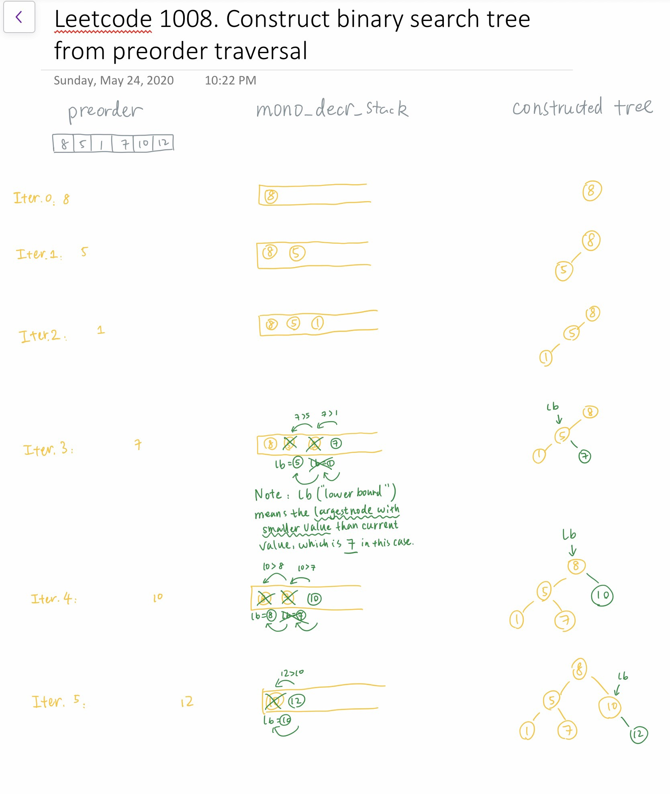
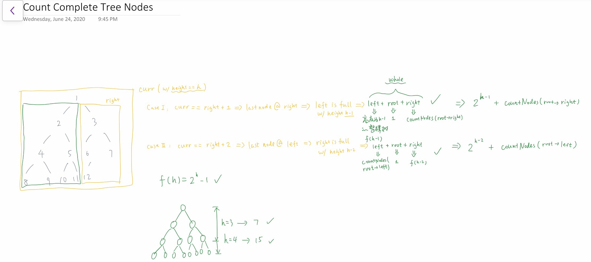

# Binary Tree

## Type 1: Path Sum

### LeetCode 124. Binary Tree Maximum Path Sum

Given a **non-empty** binary tree, find the maximum path sum.

For this problem, a path is defined as any sequence of nodes from some starting node to any node in the tree along the parent-child connections. The path must contain **at least one node** and does not need to go through the root.

**Example 1:**

```text
Input: [1,2,3]

       1
      / \
     2   3

Output: 6
```

**Example 2:**

```text
Input: [-10,9,20,null,null,15,7]

   -10
   / \
  9  20
    /  \
   15   7

Output: 42
```

#### Logic:

* Basic idea: **divide and conquer**
* Have to seperate: \(1\) current step max and \(2\) global max
* Update \(1\) current step max:
  * Must have: `root->val`
  * Could have: max of `left_sum` and `right_sum`, while the max must be larger than `0`
* Update \(2\) global max:
  *  understanding 1 - take `max()`among the four choices:
    * `root->val`
    * `root->val + left_sum`
    * `root->val + right_sum`
    * `root->val + left_sum + right_sum`
  * Understanding 2:
    * `root->val + max(0, left_sum) + max(0, right_sum)`

**Sample code:**


```cpp
class Solution {
public:
    int max_sum_global = INT_MIN;
    int iterate(TreeNode* root) {
        if (root == nullptr)
            return 0;
        int left_sum = iterate(root->left);
        int right_sum = iterate(root->right);
        
        // update global max sum
        int cur_max = root->val;
        cur_max = max(cur_max, root->val + left_sum);
        cur_max = max(cur_max, root->val + right_sum);
        cur_max = max(cur_max, root->val + left_sum + right_sum);
        max_sum_global = max(cur_max, max_sum_global);

        int for_next_step = root->val + max(0, max(left_sum, right_sum));
        return for_next_step;
    }
    
    int maxPathSum(TreeNode* root)
    {
        iterate(root);
        return max_sum_global;
    }
};
```


## Type 2: Preorder Traversal

### LeetCode 1008. Construct Binary Search Tree From Preorder Traversal

Return the root node of a binary **search** tree that matches the given `preorder` traversal.

_\(Recall that a binary search tree is a binary tree where for every node, any descendant of `node.left` has a value `<` `node.val`, and any descendant of `node.right` has a value `>` `node.val`.  Also recall that a preorder traversal displays the value of the `node` first, then traverses `node.left`, then traverses `node.right`.\)_

It's guaranteed that for the given test cases there is always possible to find a binary search tree with the given requirements.

**Example 1:**

```text
Input: [8,5,1,7,10,12]
Output: [8,5,10,1,7,null,12]

```

**Constraints:**

* `1 <= preorder.length <= 100`
* `1 <= preorder[i] <= 10^8`
* The values of `preorder` are distinct.

Logic:

* **Monotonic Decreasing Stack** + **Lowerbound** ideation
* In BST, the lowerbound \(the largest node with smaller value than `preorder[i]`\) of a right subtree is its father 




```cpp
/**
 * Definition for a binary tree node.
 * struct TreeNode {
 *     int val;
 *     TreeNode *left;
 *     TreeNode *right;
 *     TreeNode() : val(0), left(nullptr), right(nullptr) {}
 *     TreeNode(int x) : val(x), left(nullptr), right(nullptr) {}
 *     TreeNode(int x, TreeNode *left, TreeNode *right) : val(x), left(left), right(right) {}
 * };
 */
 
/*  Written Style 1.0: clear demonstration but wordy */
class Solution {
public:
    TreeNode* bstFromPreorder(vector<int>& preorder) {
        stack<TreeNode*> mono_decr;
        TreeNode* root = new TreeNode(preorder[0]);
        mono_decr.push(root);
        
        for (int i = 1; i < preorder.size(); i++)
        {
            if (preorder[i] < mono_decr.top()->val)
            {
                TreeNode* node = new TreeNode(preorder[i]);
                mono_decr.top()->left = node;
                mono_decr.push(node);
            }
            else
            {
                TreeNode* lb;
                while (mono_decr.size() > 0 && mono_decr.top()->val <= preorder[i])
                {
                    lb = mono_decr.top();
                    mono_decr.pop();
                }
                TreeNode* node = new TreeNode(preorder[i]);
                lb->right = node;
                mono_decr.push(node);
            }
        }
        
        return root;
    }
};

/* Written Style 1.1: shorter version of Style 1.0 */
class Solution {
public:
    TreeNode* bstFromPreorder(vector<int>& preorder) {
        stack<TreeNode*> mono_decr;
        TreeNode* root = new TreeNode(preorder[0]);
        mono_decr.push(root);
        
        for (int i = 1; i < preorder.size(); i++)
        {
            TreeNode* node = new TreeNode(preorder[i]);
            if (preorder[i] < mono_decr.top()->val)
                mono_decr.top()->left = node;
            else
            {
                TreeNode* lb; // the node with largest smaller value than preorder[i]
                while (mono_decr.size() > 0 && mono_decr.top()->val <= preorder[i])
                {
                    lb = mono_decr.top();
                    mono_decr.pop();
                }
                lb->right = node;
            }
            mono_decr.push(node);
        }

        return root;
    }
};

/* Written Style 2.0: even shorter */
class Solution {
public:
    TreeNode* bstFromPreorder(vector<int>& preorder) {
        stack<TreeNode*> monotonic_decr;
        TreeNode* root = new TreeNode(preorder[0]);
        monotonic_decr.push(root);
        
        for (int i = 1; i < preorder.size(); i++)
        {
            int item = preorder[i];
            TreeNode* curr = monotonic_decr.top();
            while (monotonic_decr.size() > 0 && monotonic_decr.top()->val < item)
            {
                curr = monotonic_decr.top();
                monotonic_decr.pop();
            }
            TreeNode* add_on = new TreeNode(item);
            if (curr->val > item)
                curr->left = add_on;
            else
                curr->right = add_on;
            monotonic_decr.push(add_on);
        }
        
        return root;
    }
};
```


#### Related Problems:

* [LeetCode 1028. Recover a Tree from Preorder Traversal](https://leetcode.com/problems/recover-a-tree-from-preorder-traversal/)
* [LintCode 1307. Verify Preorder Sequence in Binary Search Tree](https://www.lintcode.com/problem/verify-preorder-sequence-in-binary-search-tree/description)

## Type 3: General

### LeetCode 226. Invert Binary Tree

Invert a binary tree.

**Example:**

Input:

```text
     4
   /   \
  2     7
 / \   / \
1   3 6   9
```

Output:

```text
     4
   /   \
  7     2
 / \   / \
9   6 3   1
```

**Trivia:**  
This problem was inspired by [this original tweet](https://twitter.com/mxcl/status/608682016205344768) by [Max Howell](https://twitter.com/mxcl):

> Google: 90% of our engineers use the software you wrote \(Homebrew\), but you can’t invert a binary tree on a whiteboard so f\*\*\* off.

#### Sample Code:


```cpp
/**
 * Definition for a binary tree node.
 * struct TreeNode {
 *     int val;
 *     TreeNode *left;
 *     TreeNode *right;
 *     TreeNode() : val(0), left(nullptr), right(nullptr) {}
 *     TreeNode(int x) : val(x), left(nullptr), right(nullptr) {}
 *     TreeNode(int x, TreeNode *left, TreeNode *right) : val(x), left(left), right(right) {}
 * };
 */
class Solution {
public:
    // Method 1: recursive (DFS)
    TreeNode* invertTree(TreeNode* root) {
        if (root == nullptr)
            return root;
        swap(root->left, root->right);
        invertTree(root->left);
        invertTree(root->right);

        return root;
    }
    // Method 2: non-recursive
    TreeNode* invertTree(TreeNode* root) {
        stack<TreeNode*> s;
        s.push(root);

        while (s.size() > 0)
        {
            auto p = s.top();
            s.pop();
            if (p == nullptr)
                continue;
            swap(p->left, p->right);
            // note: it doesn't matter which side to push to s firstly
            s.push(p->left);
            s.push(p->right);
        }

        return root;
    }
};
```


## Type 4: Depth related

### LeetCode 222. Count Complete Tree Nodes

Given a **complete** binary tree, count the number of nodes.

**Note:**

**Definition of a complete binary tree from** [**Wikipedia**](http://en.wikipedia.org/wiki/Binary_tree#Types_of_binary_trees)**:**  
In a complete binary tree every level, except possibly the last, is completely filled, and all nodes in the last level are as far left as possible. It can have between 1 and 2h nodes inclusive at the last level h.

**Example:**

```text
Input: 
    1
   / \
  2   3
 / \  /
4  5 6

Output: 6
```

#### Logic:

* Use the strategy of divide and conquer, check [this discussion page](https://leetcode.com/problems/count-complete-tree-nodes/discuss/61958/Concise-Java-solutions-O%28log%28n%292%29) for detailed information




```cpp
/**
 * Definition for a binary tree node.
 * struct TreeNode {
 *     int val;
 *     TreeNode *left;
 *     TreeNode *right;
 *     TreeNode() : val(0), left(nullptr), right(nullptr) {}
 *     TreeNode(int x) : val(x), left(nullptr), right(nullptr) {}
 *     TreeNode(int x, TreeNode *left, TreeNode *right) : val(x), left(left), right(right) {}
 * };
 */
class Solution {
public:
    int height(TreeNode* root) {
        if (!root) return 0; // one node has height 1, zero node has height 0
        return 1 + height(root->left);
    }
    
    int countNodes(TreeNode* root) {
        if (!root) return 0;
        int h = height(root);

        // Note: pow(2, n) == 1 << n
        // example: 1 << 0 == 1, 1 << 1 == 2, 1 << 2 == 4, 1 << 3 == 8 ... 1 << n == 2^n
        if (height(root->right) == h - 1) { // the last node is on right subtree => left subtree has full nodes => left: 2^(h-1)-1 == (1 << h-1) - 1
            return ( 1 << h-1 ) + countNodes(root->right); // left(2^(h-1)-1) + root(1) + right
        } else { // the last node is on left subtree => right subtree has full nodes within h-2 levels => right: 2^(h-2) - 1 == (1 << h-2) - 1
            return ( 1 << h-2 ) + countNodes(root->left); // right(2^(h-2)-1) + root(1) + left
        }
    }
};
```


