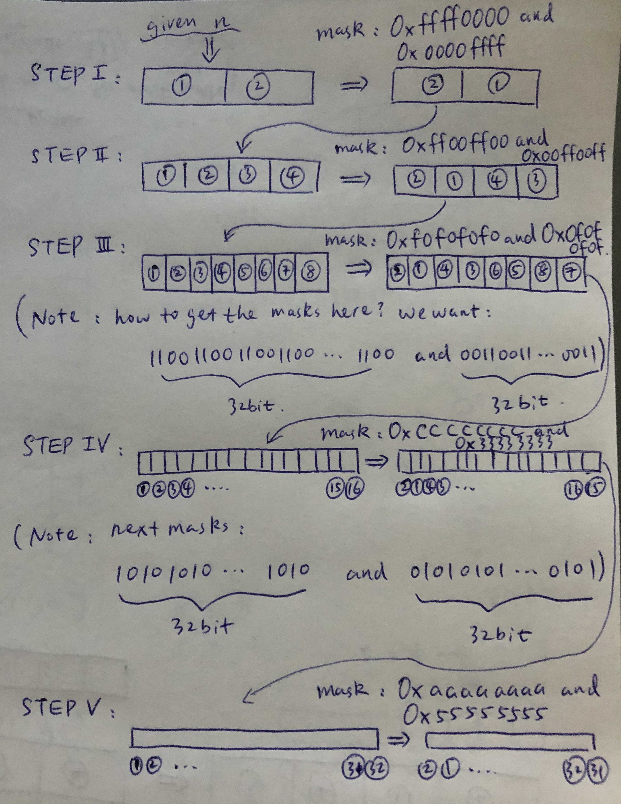

# Bit Operation

## Type 1: Bitwise AND \(`&`\)

### LeetCode 231. Power Of Two

Given an integer, write a function to determine if it is a power of two.

**Example 1:**

```text
Input: 1
Output: true 
Explanation: 20 = 1
```

**Example 2:**

```text
Input: 16
Output: true
Explanation: 24 = 16
```

**Example 3:**

```text
Input: 218
Output: false
```

#### **Logic:**

* If `n` is the power of two:
  * `n = 2 ^ 0 = 1 = 0b0000...00000001, and (n - 1) = 0 = 0b0000...0000`
  * `n = 2 ^ 1 = 2 = 0b0000...00000010, and (n - 1) = 1 = 0b0000...0001`
  * `n = 2 ^ 2 = 4 = 0b0000...00000100, and (n - 1) = 3 = 0b0000...0011`
  * `n = 2 ^ 3 = 8 = 0b0000...00001000, and (n - 1) = 7 = 0b0000...0111`
* Thus, for any `n` which is the power of `2` we have: **`n & (n-1) == 0b0000...0000 (== 0)`**
* Otherwise, for any `n` which is not the power of 2, we have: **`n & (n-1) != 0`**
  * For example, `n =14 = 0b0000...1110`, and `(n - 1) = 13 = 0b0000...1101`, we have `n & (n-1) != 0`
* Check [this discuss](https://leetcode.com/problems/power-of-two/discuss/63966/4-different-ways-to-solve-Iterative-Recursive-Bit-operation-Math) note for reference.

#### Sample Code:


```cpp
class Solution {
public:
    bool isPowerOfTwo(int n) {
        return n > 0 && ((n & (n-1)) == 0);
    }
};
```


## Type 2: Bitwise OR \(`|`\)

### LeetCode 190. Reverse Bits

Reverse bits of a given 32 bits unsigned integer.

**Example 1:**

```text
Input: 00000010100101000001111010011100
Output: 00111001011110000010100101000000
Explanation: The input binary string 00000010100101000001111010011100 represents the unsigned integer 43261596, so return 964176192 which its binary representation is 00111001011110000010100101000000.
```

**Example 2:**

```text
Input: 11111111111111111111111111111101
Output: 10111111111111111111111111111111
Explanation: The input binary string 11111111111111111111111111111101 represents the unsigned integer 4294967293, so return 3221225471 which its binary representation is 10111111111111111111111111111111.
```

**Note:**

* Note that in some languages such as Java, there is no unsigned integer type. In this case, both input and output will be given as signed integer type and should not affect your implementation, as the internal binary representation of the integer is the same whether it is signed or unsigned.
* In Java, the compiler represents the signed integers using [2's complement notation](https://en.wikipedia.org/wiki/Two%27s_complement). Therefore, in **Example 2** above the input represents the signed integer `-3` and the output represents the signed integer `-1073741825`.

**Follow up**:

If this function is called many times, how would you optimize it?

#### Logic:

* Method 1: loop, and reverse, `O(N)` time complexity, `N` meaning the bit number of the given type.
* Method 2: divide and conquer, `O(logN)` time complexity, check the details in the picture below




```cpp
class Solution {
public:
    /* method 1: reverse by loop */
    uint32_t reverseBits(uint32_t n) {
        uint32_t init = n, copy = 0;
        for (int i = 0; i < 31; i++) {
            copy += (init & 1);
            copy <<= 1;
            init >>= 1;
        }
        copy += (init & 1);
        return copy;
    }

    /* method 2: reverse by divide-and-conquer with bit mask */
    uint32_t reverseBits(uint32_t n) {
        // step I: switch 16-bit parts
        n = ( (n & 0xffff0000) >> 16 | (n & 0x0000ffff) << 16 );
        
        // step II: switch 8-bit parts
        n = ( (n & 0xff00ff00) >> 8 | (n & 0x00ff00ff) << 8 );
        
        // step III: switch 4-bit parts
        n = ( (n & 0xf0f0f0f0) >> 4 | (n & 0x0f0f0f0f) << 4 );
        
        // step IV: switch 2-bit parts
        n = ( (n & 0xcccccccc) >> 2 | (n & 0x33333333) << 2 );
        
        // step V: switch 1-bit parts
        n = ( (n & 0xaaaaaaaa) >> 1 | (n & 0x55555555) << 1 );
        
        return n;
    }
};
```



