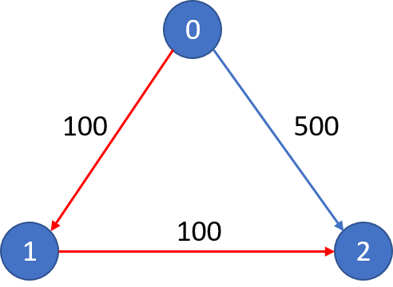

# Breadth-First-Search \(BFS\)

## Type 1: Directed Graph

### LeetCode 787. Cheapest Flights Within K Stops

There are `n` cities connected by `m` flights. Each flight starts from city `u` and arrives at `v` with a price `w`.

Now given all the cities and flights, together with starting city `src` and the destination `dst`, your task is to find the cheapest price from `src` to `dst` with up to `k` stops. If there is no such route, output `-1`.

```text
Example 1:
Input: 
n = 3, edges = [[0,1,100],[1,2,100],[0,2,500]]
src = 0, dst = 2, k = 1
Output: 200
Explanation: 
The graph looks like this: (check pic - Case I)


The cheapest price from city 0 to city 2 with at most 1 stop costs 200, as marked red in the picture.
```



```text
Example 2:
Input: 
n = 3, edges = [[0,1,100],[1,2,100],[0,2,500]]
src = 0, dst = 2, k = 0
Output: 500
Explanation: 
The graph looks like this: (check pic - Case II)


The cheapest price from city 0 to city 2 with at most 0 stop costs 500, as marked blue in the picture.
```


**Constraints:**

* The number of nodes `n` will be in range `[1, 100]`, with nodes labeled from `0` to `n - 1`.
* The size of `flights` will be in range `[0, n * (n - 1) / 2]`.
* The format of each flight will be `(src, dst, price)`.
* The price of each flight will be in the range `[1, 10000]`.
* `k` is in the range of `[0, n - 1]`.
* There will not be any duplicated flights or self cycles.

#### Logic:

* Using directly BFS will TLE, need some branches cutting:
  * When a stop is visited, and the previous accumulative prices is less than or equal to current accumulative price, skip this stop
  * When the current price is already larger than global minimum, exit this route

#### Sample Code:


```cpp
class Solution {
private:
    unordered_map<int, unordered_map<int, int>> price_map; // key: src city, val: {dst city, price} 
public:
    int findCheapestPrice(int n, vector<vector<int>>& flights, int src, int dst, int K) {
        // construct price_map
        for (auto f : flights) {
            int s = f[0], d = f[1], p = f[2];
            if (price_map.count(s) == 0) price_map.insert({s, {}});
            price_map[s].insert({d, p});
        }
        // bfs
        queue<pair<int, int>> q; // {curr stop, accumulative price}
        q.push({src, 0});
        unordered_map<int, int> visit; // key: visited stop, val: visited price
        int stop = 0, min_cost = 0x3f3f3f3f;
        while (q.size() > 0) {
            int sz = q.size();
            for (int i = 0; i < sz; i++) {
                int curr_stop = q.front().first;
                int curr_prc  = q.front().second;
                q.pop();
                // check if it's in the dst
                if (curr_stop == dst) {
                    min_cost = min(min_cost, curr_prc);
                }
                // cutting branches: if the current price is already larger than global minimum, exit
                if (curr_prc > min_cost) continue;
                // move to next destinations
                auto dsts = price_map[curr_stop];
                for (auto it = dsts.begin(); it != dsts.end(); it++) {
                    if (visit.count(it->first) && visit[it->first] < curr_prc) {
                        // if the stop is visited, and the previous accumulative prices is less than curr_prc
                        continue;
                    }
                    q.push({it->first, curr_prc + it->second});
                    visit[it->first] = curr_prc + it->second;
                }
            }
            // process the stop
            if (stop++ > K) break;
        }

        return min_cost >= 0x3f3f3f3f ? -1 : min_cost;
    }
};
```


