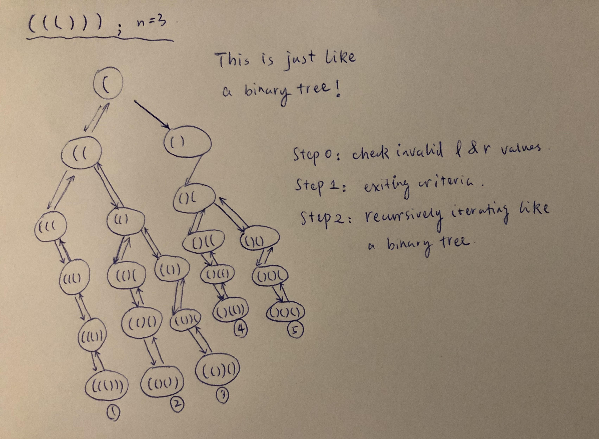
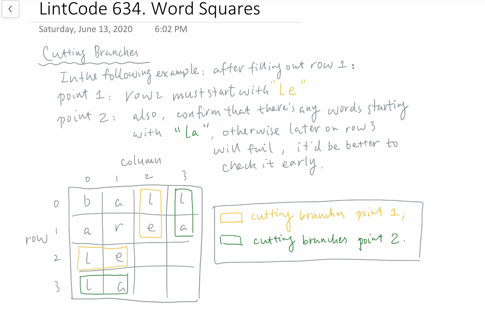

# Depth-First-Search \(DFS\)

## Type 1: Classic DFS

### LintCode 570. Find the Missing Number II

Giving a string with number from 1-`n` in random order, but miss `1` number.Find that number.

* _n &lt;= 30_
* _Data guarantees have only one solution_

#### Example

**Example1**

```text
Input: n = 20 and str = 19201234567891011121314151618
Output: 17
Explanation:
19'20'1'2'3'4'5'6'7'8'9'10'11'12'13'14'15'16'18
```

**Example2**

```text
Input: n = 6 and str = 56412
Output: 3
Explanation:
5'6'4'1'2
```

#### Logic:

* DFS classic question, need to apply several techniques of cutting branches
* Refer to [this page](https://www.jiuzhang.com/solution/find-the-missing-number-ii/) for detailed solution

#### Sample Code:


```cpp
class Solution {
public:
    /**
     * @param n: indicating numbers range [1, n] with a missing number
     * @param str: the given string
     * @param cnt: number of found numbers
     * @param pos: iterating position @ str
     * @param visit: all visited nums within [1, n]
     * @return: the missing number; -1 if invalid output
     */
    int dfs(int n, string& str, int cnt, int pos, vector<int>& visit) {
        // stop criteria
        if (cnt == n - 1 && pos == str.length()) {
            // cout << "hello!!!\n";
            int res = -1;
            for (int i = 1; i <= n; i++) {
                if (visit[i] == 0) return i;
            }
            // if all the visit[i] == 1, invalid
            return -1;
        }

        // cutting branches
        int rest_num  = n - 1 - cnt;
        int rest_char = str.length() - pos;
        if (rest_char < rest_num || rest_char > rest_num * 2 || str[pos] == '0') { 
            // the rest nums of char is smaller than rest nums of uncounted numbers, OR
            // the rest nums of char is larger than twice of rest nums of uncounted numbers
            // invalid number starting from digit '0'
            return -1;
        }
        
        // two options to expand: 1 digit & 2 digits
        int curr_num = 0;
        for (int num_dgt = 0; num_dgt <= 1; num_dgt++) {
            curr_num = curr_num * 10 + str[pos+num_dgt] - '0';
            if (curr_num >= 1 && curr_num <= n && visit[curr_num] == 0) {
                visit[curr_num] = 1;
                int ans = dfs(n, str, cnt+1, pos+num_dgt+1, visit);
                if (ans > 0) return ans;
                visit[curr_num] = 0;
            }
        }

        // in the end, if nothing found...
        return -1;
    }

    /**
     * @param n: An integer
     * @param str: a string with number from 1-n in random order and miss one number
     * @return: An integer
     */
    int findMissing2(int n, string &str) {
        // write your code here
        vector<int> visit(n+1, 0);
        return dfs(n, str, 0, 0, visit);
    }
};
```


### LintCode 427. Generate Paranthesis

Given n, and there are n pairs of parentheses, write a function to generate all combinations of well-formed parentheses.

#### Example

**Example 1:**

```text
Input: 3
Output: ["((()))", "(()())", "(())()", "()(())", "()()()"]
```

**Example 2:**

```text
Input: 2
Output: ["()()", "(())"]
```

#### Logic:

* The whole architecture of this problram is very similar to a _**binary tree**_
* DFS flows:
  * Step 0: check validness of value `l` and `r`
  * Step 1: \(ending criteria\) gather information if `l == n && r == n`
  * Step 2: \(DFS iteration\) expand the next steps:
    * adding `'('` while updating `l` by `l = l + 1` \( &lt;=&gt; stepping into the left subtree \)
    * adding `')'` while updating `r` by `r = r + 1` **\(** &lt;=&gt;  stepping into the right subtree \)



#### Sample Code:


```cpp
class Solution {
public:
    /**
     * @param n: n pairs of parentheses
     * @param l: number of left parantheses used
     * @param r: number of right parantheses used
     * @param result: a valid combination of parantheses generated in current loop
     * @param results: an array of generated parantheses
     */ 
    void dfs(int n, int l, int r, string result, vector<string>& results) {
        // step 0: check if the l and r have valid values
        if (l > n || r > n || l < r) return;
        // step 1: ending criteria
        if (l == n && r == n) {
            results.push_back(result);
            return;
        }
        // step 2: recurssion's next steps -- imagining this is iterating a binary tree recursively
        // first go to left subtree -- adding '('
        dfs(n, l+1, r, result + '(', results);
        // secondly go to right subtree -- addig ')'
        dfs(n, l, r+1, result + ')', results);
    }

    /**
     * @param n: n pairs
     * @return: All combinations of well-formed parentheses
     */
    vector<string> generateParenthesis(int n) {
        // write your code here
        vector<string> results;
        string result = "";
        dfs(n, 0, 0, result, results);
        return results;
    }
};
```


### LintCode 802. Sudoku Solver

#### Description

Write a program to solve a Sudoku puzzle by filling the empty cells.

Empty cells are indicated by the number `0`.

You may assume that there will be only one unique solution.

#### Example

**Example 1:**

```text
Given a Sudoku puzzle:
```


```text
Return its solution:
```


#### Logic:

* The `dfs()` must return a `bool` indicator, to be used as a **flag** during the loop that help us decide _"shall we end the loop after finding a valid solution"_
* It's convinient to use function `isValid()`to check if a proposed `num (1~9)` is valid given the configuration
* The code is self-explatory, refer it for further information


```cpp
class Solution {
public:
    /**
     * @param board: the sudoku puzzle
     * @param r: current row
     * @param c: current col
     * @param num: current trial number (1-9)
     * @return: if a feasible solution is found
     */
    bool dfs(vector<vector<int>>& board, int r, int c) {
        // go beyond each row
        if (c >= 9) return dfs(board, r+1, 0);

        // finished every cell
        if (r >= 9) return true;

        // if at a filled cell, go next cell
        if (board[r][c] > 0) return dfs(board, r, c+1);

        // try each numer at an empty cell
        for (int i = 1; i <= 9; i++) {
            // if not valid, go to next choice of number
            if (!isValid(board, r, c, i)) continue;

            // propose the valid number
            board[r][c] = i;
            
            // only return true (end the loop) if dfs() is true;
            // but if it is false, still have chance to correct, don't just return false (end the loop)
            if (dfs(board, r, c+1)) return true;

            // backtrack
            board[r][c] = 0;
        }

        // if after trying 9 choices still not good, go back
        return false;
    }

    /**
     * @param board: the sudoku puzzle
     * @param r: current row
     * @param c: current col
     * @param num: the propsed number
     * @return: if the current configuartion of the sudoku puzzle is valid
     */
    bool isValid(vector<vector<int>>& board, int r, int c, int num) {
        // check horizontal line
        for (int i = 0; i < 9; i++) {
            if (board[r][i] == num) return false;
        }

        // check vertical line
        for (int i = 0; i < 9; i++) {
            if (board[i][c] == num) return false;
        }

        // check the current 3-by-3-block
        int cur_bol_i = r / 3; // current block index, i
        int cur_bol_j = c / 3; // current block index, j
        for (int i = cur_bol_i*3; i < cur_bol_i*3 + 3; i++) {
            for (int j = cur_bol_j*3; j < cur_bol_j*3 + 3; j++) {
                if (board[i][j] == num) return false;
            }
        }

        // if no duplicate number found, the proposal is valid
        return true;
    }

    /**
     * @param board: the sudoku puzzle
     * @return: nothing
     */
    void solveSudoku(vector<vector<int>> &board) {
        dfs(board, 0, 0);
    }
};u
```


### LintCode 634. Word Squares

#### Description

Given a set of words **without duplicates**, find all [`word squares`](https://en.wikipedia.org/wiki/Word_square) you can build from them.

A sequence of words forms a valid word square if the kth row and column read the exact same string, where 0 ≤ k &lt; max\(numRows, numColumns\).

For example, the word sequence `["ball","area","lead","lady"]` forms a word square because each word reads the same both horizontally and vertically.

```text
b a l l
a r e a
l e a d
l a d y
```

* There are at least 1 and at most 1000 words.
* All words will have the exact same length.
* Word length is at least 1 and at most 5.
* Each word contains only lowercase English alphabet `a-z`.

#### Example

**Example 1:**

```text
Input:
["area","lead","wall","lady","ball"]
Output:
[["wall","area","lead","lady"],["ball","area","lead","lady"]]

Explanation:
The output consists of two word squares. The order of output does not matter (just the order of words in each word square matters).
```

**Example 2:**

```text
Input:
["abat","baba","atan","atal"]
Output:
 [["baba","abat","baba","atan"],["baba","abat","baba","atal"]]
```

#### Logic:

* Use two points of cutting branches to speed up the algorithm
  * Point 1: use `prefix` to rule out invalid words, i.e., at each new step, must check previous filled rows to start with a solid `prefix`
  * Point 2:  after completing each row, check for the sake of next rows, that if there's any valid choices of based on the current configuration; if one of them not even existing, just don't even bother push forward and just stop at this step.
  * \(Point 2:  PENDING TO BE IMPLEMENTED IN THE CODE\)
* check the picture below for reference



#### Sample Code:


```cpp
class Solution {
public:
    /**
     * @param words: a set of words without duplicates
     * @param pf_dict: a hashmap containing all the words by the key of prefix
     * @param k: the word length
     * @param result: the current trial of result
     * @param results: collection of valid results
     * @param prefix: the required prefix of current configuration of result
     * @return: nothing
     */
    void memoSearch(vector<string>& words,
                    unordered_map<string, unordered_set<string>>& pf_dict,
                    int k,
                    vector<string>& result,
                    vector<vector<string>>& results,
                    string prefix) {
        // exit criteria
        if (result.size() == k) {
            results.push_back(result);
            return;
        }

        // construct the prefix (reset it first)
        int idx = result.size();
        prefix = "";
        for (int i = 0; i < idx; i++) {
            prefix.push_back(result[i][idx]); // draw a picture and can be easily obtained
        }
        
        // loop the given words to continue dfs
        for (auto word : pf_dict[prefix]) {
            result.push_back(word);
            memoSearch(words, pf_dict, k, result, results, prefix);
            result.pop_back();
        }
    }

    /**
     * @param words: a set of words without duplicates
     * @return: all word squares
     */
    vector<vector<string>> wordSquares(vector<string> &words) {
        if (words.size() == 0) return {};
        int k = words[0].size();
        unordered_map<string, unordered_set<string>> pf_dict; // key: prefix, value: unordered_set of strings with the given prefix

        // Step I: construct the pf_dict hash map
        // 1. key of empty string has all the given words as its val
        // 2. loop each prefix
        pf_dict[""] = {};
        for (auto word : words) {
            pf_dict[""].insert(word);
            for (int i = 1; i <= word.size(); i++) {
                string prefix = word.substr(0, i);
                if (pf_dict.count(prefix) == 0) pf_dict.insert({prefix, {}});
                pf_dict[prefix].insert(word);
            }
        }

        // Step II: conduct the dfs / memoSearch
        vector<string> result;
        vector<vector<string>> results;
        string prefix = "";
        memoSearch(words, pf_dict, k, result, results, prefix);
        
        return results;
    }
};
```


## Type 2: DFS on a Binary Tree

### LintCode 535. House Robber III

The thief has found himself a new place for his thievery again. There is only one entrance to this area, called the "root." Besides the root, each house has one and only one parent house. After a tour, the smart thief realized that "all houses in this place forms a binary tree". It will automatically contact the police if two directly-linked houses were broken into on the same night.

Determine the maximum amount of money the thief can rob tonight without alerting the police.

This problem is the extention of [House Robber](http://www.lintcode.com/problem/house-robber/) and [House Robber II](http://www.lintcode.com/problem/house-robber-ii/)

#### Example

**Example1**

```text
Input:  {3,2,3,#,3,#,1}
Output: 7
Explanation:
Maximum amount of money the thief can rob = 3 + 3 + 1 = 7.
  3
 / \
2   3
 \   \ 
  3   1
```

**Example2**

```text
Input:  {3,4,5,1,3,#,1}
Output: 9
Explanation:
Maximum amount of money the thief can rob = 4 + 5 = 9.
    3
   / \
  4   5
 / \   \ 
1   3   1
```

#### Logic:

* Use two information items during the robber's trajectory, i.e., at each root of a subtree:
  * First number: with robbering the house @root
  * Second number: without robbering the house @root

#### Sample Code:


```cpp
/**
 * Definition of TreeNode:
 * class TreeNode {
 * public:
 *     int val;
 *     TreeNode *left, *right;
 *     TreeNode(int val) {
 *         this->val = val;
 *         this->left = this->right = NULL;
 *     }
 * }
 */

class Solution {
public:
    /**
     * @param root: the root of binary tree.
     * @return: maximum amount of money with rubbing or not the root
     */
    pair<int, int> dfs(TreeNode* root) {
        if (root == nullptr) return {0, 0};
        pair<int, int> left = dfs(root->left), right = dfs(root->right);
        
        return {root->val + left.second + right.second, 
                max(right.first, right.second) + max(left.first, left.second)}; 
    }

    /**
     * @param root: The root of binary tree.
     * @return: The maximum amount of money you can rob tonight
     */
    int houseRobber3(TreeNode * root) {
        // write your code here
        pair<int, int> head = dfs(root);
        return max(head.first, head.second);
    }
};
```


#### Similar topics:

* Path sum questions on a binary search tree

