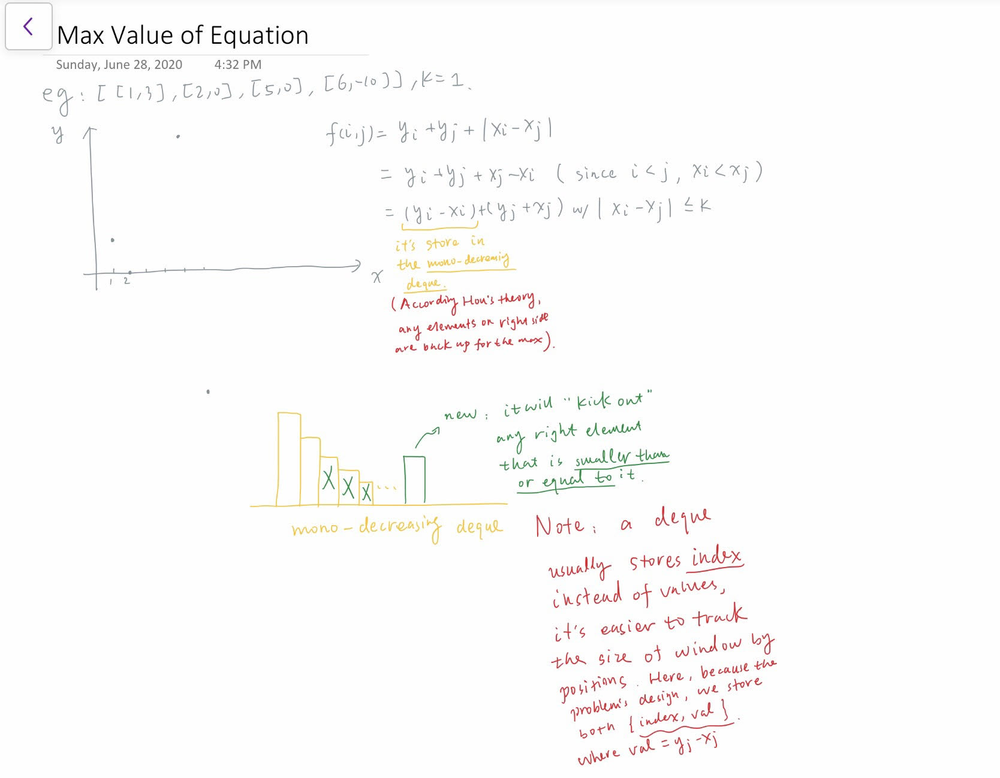

# Deque

## Type 1: Monotonically Decreasing Deque

### LeetCode 1499. Max Value of Equation

Given an array `points` containing the coordinates of points on a 2D plane, sorted by the x-values, where `points[i] = [xi, yi]` such that `xi < xj` for all `1 <= i < j <= points.length`. You are also given an integer `k`.

Find the _maximum value of the equation_ `yi + yj + |xi - xj|` where `|xi - xj| <= k` and `1 <= i < j <= points.length`. It is guaranteed that there exists at least one pair of points that satisfy the constraint `|xi - xj| <= k`.

**Example 1:**

```text
Input: points = [[1,3],[2,0],[5,10],[6,-10]], k = 1
Output: 4
Explanation: The first two points satisfy the condition |xi - xj| <= 1 and if we calculate the equation we get 3 + 0 + |1 - 2| = 4. Third and fourth points also satisfy the condition and give a value of 10 + -10 + |5 - 6| = 1.
No other pairs satisfy the condition, so we return the max of 4 and 1.
```

**Example 2:**

```text
Input: points = [[0,0],[3,0],[9,2]], k = 3
Output: 3
Explanation: Only the first two points have an absolute difference of 3 or less in the x-values, and give the value of 0 + 0 + |0 - 3| = 3.
```

**Constraints:**

* `2 <= points.length <= 10^5`
* `points[i].length == 2`
* `-10^8 <= points[i][0], points[i][1] <= 10^8`
* `0 <= k <= 2 * 10^8`
* `points[i][0] < points[j][0]` for all `1 <= i < j <= points.length`
* `xi` form a strictly increasing sequence.

Logic:

* The first step is decompose the equation, noticed that `xi < xj` always holds, and re-formulate the problem as shown in the picture below:



#### Sample Code:


```cpp
class Solution {
public:
    int findMaxValueOfEquation(vector<vector<int>>& points, int k) {
        deque<pair<int, int>> dq; // stores xi's index
        int max_val = 0xcfcfcfcf;
        
        int n = points.size();
        for (int j = 0; j < n; j++) {
            int xj = points[j][0], yj = points[j][1];
            
            // take care of window size first
            while (dq.size() > 0 && xj - dq.front().first > k) {
                dq.pop_front();
            }

            // update max_val
            if (dq.size() > 0) {
                max_val = max(max_val, dq.front().second + yj + xj);
            }

            // take care of mono-decreasing deque third
            while (dq.size() > 0 && dq.back().second < yj - xj) {
                dq.pop_back();
            }

            // update deque
            dq.push_back({xj, yj - xj});
        }

        return max_val;
    }
};
```


