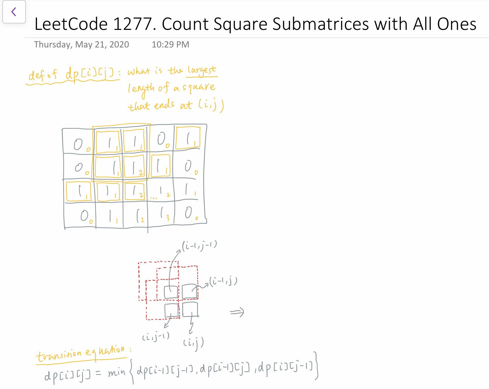
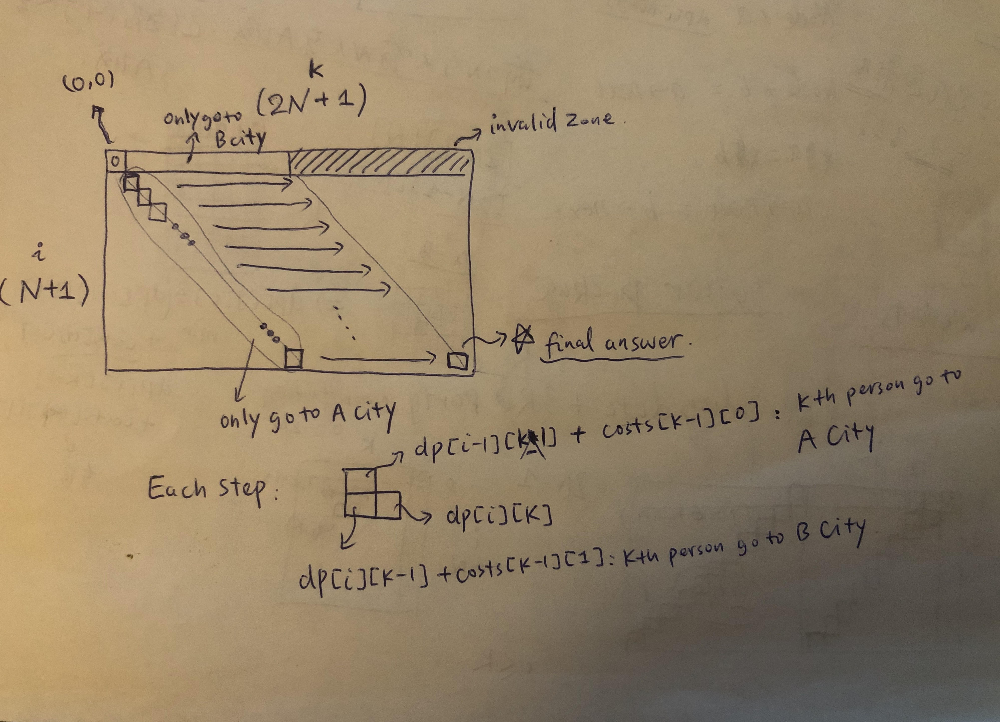
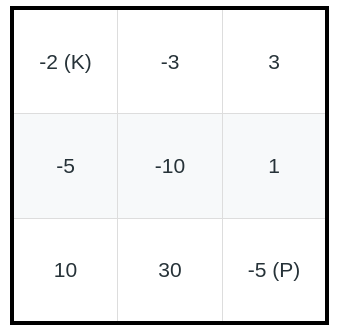
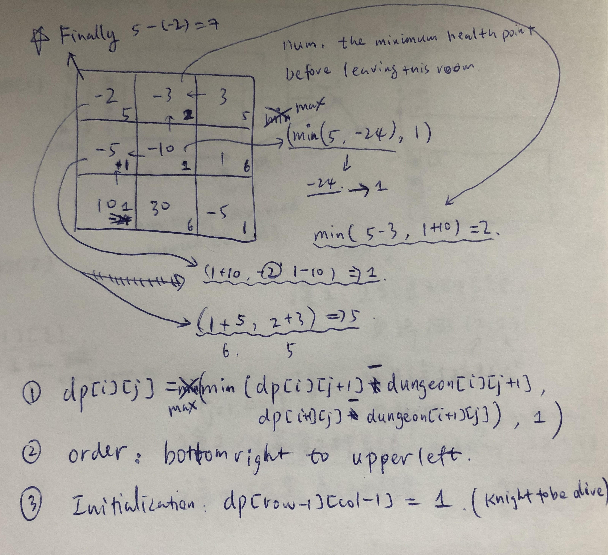
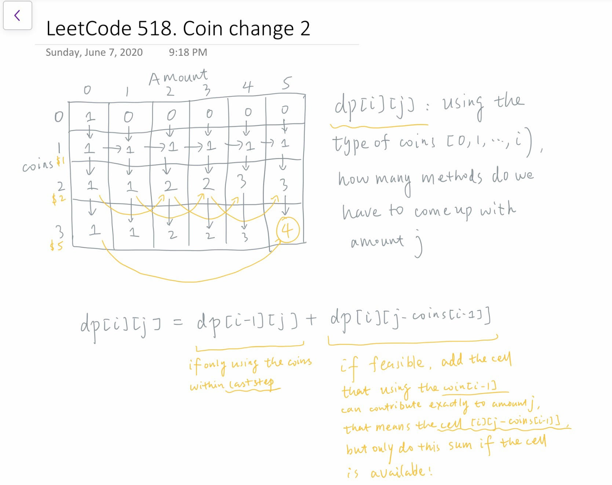
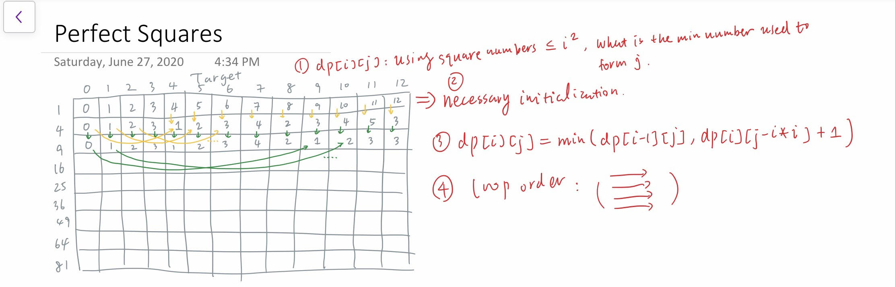
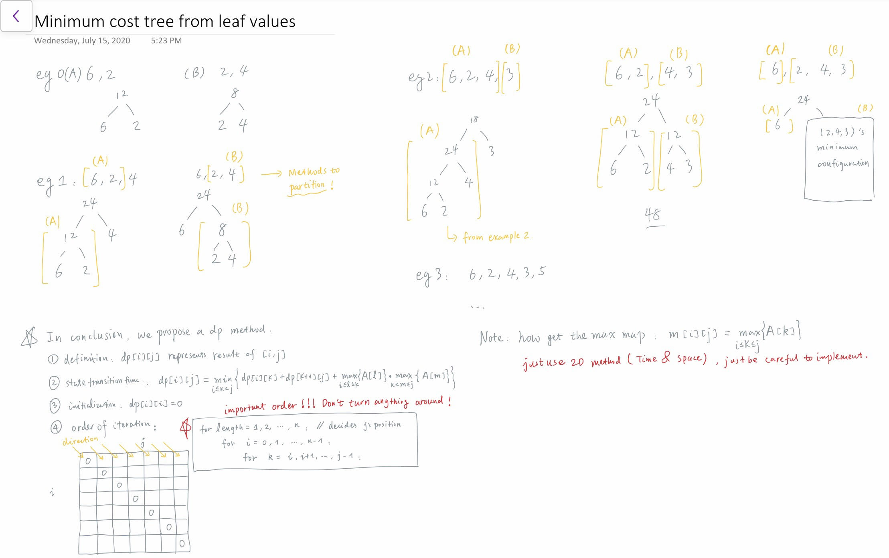
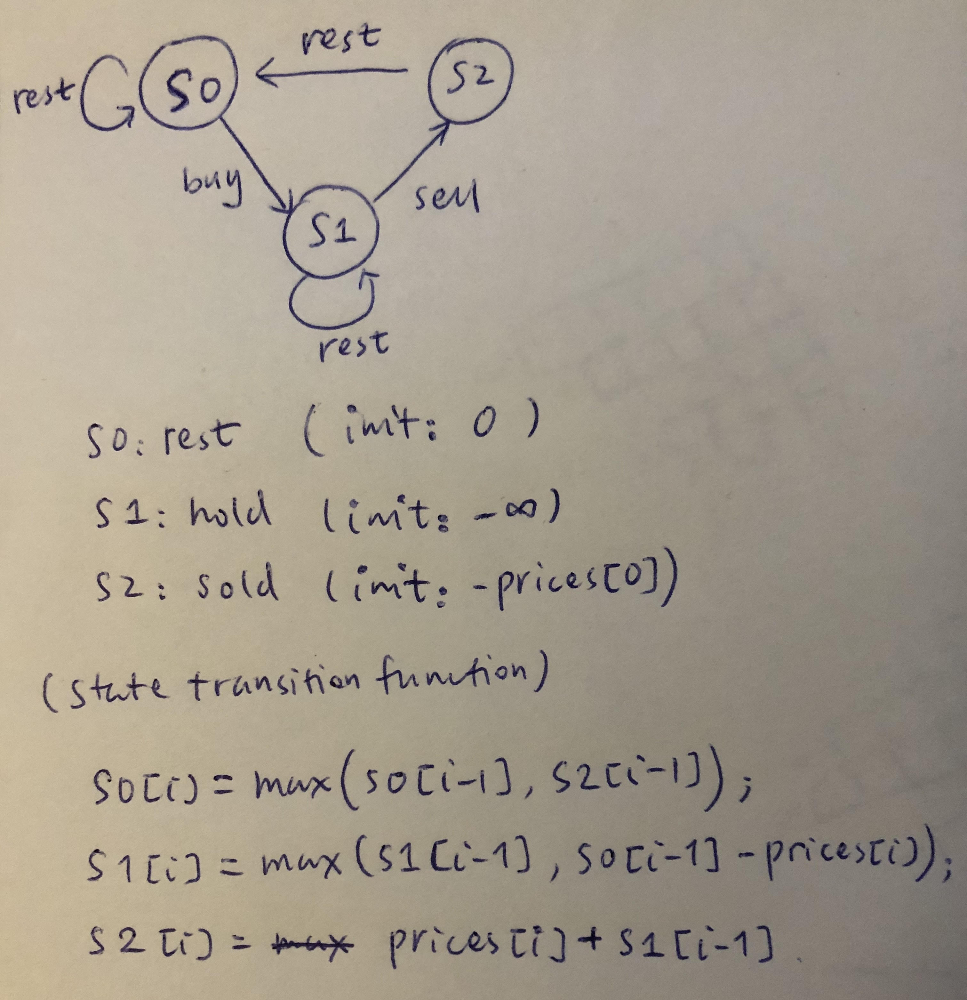

# Dynamic Programming

## Type 1: Simple DP

### LeetCode 1277. Count Square Matrices with All Ones

Given a `m * n` matrix of ones and zeros, return how many **square** submatrices have all ones.

**Example 1:**

```text
Input: matrix =
[
  [0,1,1,1],
  [1,1,1,1],
  [0,1,1,1]
]
Output: 15
Explanation: 
There are 10 squares of side 1.
There are 4 squares of side 2.
There is  1 square of side 3.
Total number of squares = 10 + 4 + 1 = 15.
```

**Example 2:**

```text
Input: matrix = 
[
  [1,0,1],
  [1,1,0],
  [1,1,0]
]
Output: 7
Explanation: 
There are 6 squares of side 1.  
There is 1 square of side 2. 
Total number of squares = 6 + 1 = 7.
```

**Constraints:**

* `1 <= arr.length <= 300`
* `1 <= arr[0].length <= 300`
* `0 <= arr[i][j] <= 1`

#### Logic:

* Simply apply dp to loop everything once, take the following picture as the intuition:



#### Sample code:


```cpp
class Solution {
public:
    int countSquares(vector<vector<int>>& matrix) {
        if (matrix.size() == 0 || matrix[0].size() == 0)
            return 0;
        int m = matrix.size(), n = matrix[0].size();

        vector<vector<int>> dp(m, vector<int>(n, 0));
        int res = 0;
        for (int i = 0; i < m; i++)
        {
            for (int j = 0; j < n; j++)
            {
                if (i == 0 || j == 0)
                    dp[i][j] = matrix[i][j];
                else
                {
                    if (matrix[i][j] == 1)
                        dp[i][j] = min(min(dp[i-1][j-1], dp[i-1][j]), dp[i][j-1]) + 1;
                }
                res += dp[i][j];
            }
            
        }

        return res;
    }
};
```


### LeetCode 1029. Two City Scheduling

There are `2N` people a company is planning to interview. The cost of flying the `i`-th person to city `A` is `costs[i][0]`, and the cost of flying the `i`-th person to city `B` is `costs[i][1]`.

Return the minimum cost to fly every person to a city such that exactly `N` people arrive in each city.

**Example 1:**

```text
Input: [[10,20],[30,200],[400,50],[30,20]]
Output: 110
Explanation: 
The first person goes to city A for a cost of 10.
The second person goes to city A for a cost of 30.
The third person goes to city B for a cost of 50.
The fourth person goes to city B for a cost of 20.

The total minimum cost is 10 + 30 + 50 + 20 = 110 to have half the people interviewing in each city.
```

**Note:**

1. `1 <= costs.length <= 100`
2. It is guaranteed that `costs.length` is even.
3. `1 <= costs[i][0], costs[i][1] <= 1000`

Logic:

* Dynamic programming is good way to handle this situation
* Need to carefully design the initialization and loop order as shown below



#### Sample Code:


```cpp
class Solution {
public:
    int twoCitySchedCost(vector<vector<int>>& costs) {
        int N = costs.size() / 2;
        // dp[i][k]: to assign i persons to A city within k persons, what is the minimum cost
        vector<vector<int>> dp(N+1, vector<int>(2*N+1, 0));

        // initialization
        for (int i = 1; i <= N; i++) {
            dp[0][i] = costs[i-1][1] + dp[0][i-1];           // only assigning persons to B city 
            dp[i][i] = costs[i-1][0] + dp[i-1][i-1];         // only assigning persons to A city
        }

        for (int i = 1; i <= N; i++) {
            for (int k = i+1; k <= i+N; k++) {
                dp[i][k] = min(dp[i-1][k-1] + costs[k-1][0], // the k-th person will go to A city
                               dp[i][k-1] + costs[k-1][1]);  // the k-th person will go to B city
            }
        }

        return dp[N][2*N];
    }
};
```


### LeetCode 368. Largest Divisible Subset

Given a set of **distinct** positive integers, find the largest subset such that every pair `(Si, Sj)` of elements in this subset satisfies: `Si % Sj = 0 or Sj % Si = 0`

If there are multiple solutions, return any subset is fine.

**Example 1:**

```text
Input: [1,2,3]
Output: [1,2] (of course, [1,3] will also be ok)
```

**Example 2:**

```text
Input: [1,2,4,8]
Output: [1,2,4,8]
```

#### Logic:

* Using dynamic programming to speed up the calculation, where
  * `dp[i]`: max length of divisible set ending @ index `i`;
  * iterating order: \(very similar as LIS\) pivoting at `i` firstly, and loop `0 <= j < i`; 
  * transition equation: check the code
* Need some helping variables to construct the actual subset `res` later \(very similar trick as LIS\):
  * Need to have a `parent[i]` to record the last largest divisor of `nums[i]`
  * Need to record the largest length `max_len` and itsnding position `max_idx`

#### Sample Code:


```cpp
class Solution {
public:
    vector<int> largestDivisibleSubset(vector<int>& nums) {
        int n = nums.size();
        if (n == 0) return {};
        
        // must sort first
        sort(nums.begin(), nums.end());
        vector<int> dp(n, 1);       // dp[i]: max length of divisible set ending @ index i
        vector<int> parent(n, -1);  // parent[i]: the last largest divisor of nums[i]
        int max_len = 1, max_idx = 0;
        
        // loop and construct dp: it's very similar to LIS
        for (int i = 0; i < n; i++) {
            for (int j = 0; j < i; j++) {
                if (nums[i] % nums[j] == 0 && dp[i] < dp[j] + 1) {
                    dp[i] = dp[j] + 1;
                    parent[i] = j;
                    
                    if (dp[i] > max_len) {
                        max_len = dp[i];
                        max_idx = i;
                    }
                }
            }
        }
        
        // construct the res using the parent array
        vector<int> res;
        int idx = max_idx;
        for (int i = 0; i < max_len; i++) {
            res.push_back(nums[idx]);
            idx = parent[idx];
        }
        
        return res;
    }
};
```


#### Similar Puzzles:

* [LeetCode 300. Longest Increasing Subsequence](https://leetcode.com/problems/longest-increasing-subsequence/)

### LeetCode 174. Dungeon Game

The demons had captured the princess \(**P**\) and imprisoned her in the bottom-right corner of a dungeon. The dungeon consists of M x N rooms laid out in a 2D grid. Our valiant knight \(**K**\) was initially positioned in the top-left room and must fight his way through the dungeon to rescue the princess.

The knight has an initial health point represented by a positive integer. If at any point his health point drops to 0 or below, he dies immediately.

Some of the rooms are guarded by demons, so the knight loses health \(_negative_ integers\) upon entering these rooms; other rooms are either empty \(_0's_\) or contain magic orbs that increase the knight's health \(_positive_ integers\).

In order to reach the princess as quickly as possible, the knight decides to move only rightward or downward in each step.

**Write a function to determine the knight's minimum initial health so that he is able to rescue the princess.**

For example, given the dungeon below, the initial health of the knight must be at least **7** if he follows the optimal path `RIGHT-> RIGHT -> DOWN -> DOWN`.



**Note:**

* The knight's health has no upper bound.
* Any room can contain threats or power-ups, even the first room the knight enters and the bottom-right room where the princess is imprisoned.

#### Logic:




```cpp
class Solution {
public:
    int calculateMinimumHP(vector<vector<int>>& dungeon) {
        if (dungeon.size() == 0 || dungeon[0].size() == 0) return 0;
        int row = dungeon.size(), col = dungeon[0].size();
        
        // dp[i][j]: minimum health point before leaving room [i, j] to keep the knight alive during the whole trip
        vector<vector<int>> dp(row, vector<int>(col, 1));
        
        // fill-in order: generally, bottom-right to top-left
        // firstly, bottom row and right col
        for (int j = col-2; j >= 0; j--) {
            dp[row-1][j] = max(dp[row-1][j+1] - dungeon[row-1][j+1], 1);
        }
        for (int i = row-2; i >= 0; i--) {
            dp[i][col-1] = max(dp[i+1][col-1] - dungeon[i+1][col-1], 1);
        }
        for (int i = row-2; i >= 0; i--) {
            for (int j = col-2; j >= 0; j--) {
                dp[i][j] = max( min(dp[i+1][j] - dungeon[i+1][j], dp[i][j+1] - dungeon[i][j+1]), 1 );
            }
        }

        return max(dp[0][0] - dungeon[0][0], 1);
    }
};
```


## Type 2: Two-Sequence

### LeetCode 1143. Longest Common Subsequence

Given two strings `text1` and `text2`, return the length of their longest common subsequence.

A _subsequence_ of a string is a new string generated from the original string with some characters\(can be none\) deleted without changing the relative order of the remaining characters. \(eg, "ace" is a subsequence of "abcde" while "aec" is not\). A _common subsequence_ of two strings is a subsequence that is common to both strings.

If there is no common subsequence, return 0.

**Example 1:**

```text
Input: text1 = "abcde", text2 = "ace" 
Output: 3  
Explanation: The longest common subsequence is "ace" and its length is 3.
```

**Example 2:**

```text
Input: text1 = "abc", text2 = "abc"
Output: 3
Explanation: The longest common subsequence is "abc" and its length is 3.
```

**Example 3:**

```text
Input: text1 = "abc", text2 = "def"
Output: 0
Explanation: There is no such common subsequence, so the result is 0.
```

**Constraints:**

* `1 <= text1.length <= 1000`
* `1 <= text2.length <= 1000`
* The input strings consist of lowercase English characters only.

#### Logic:

* Use dynamic programming to describe the matching process
  * `dp[i][j]` represents: within the front `i` letters of `text1`, and front `j` letters of `text2` what is the longest common subsequence
  * with the `dp` definition above, we need to have `m+1` and `n+1` as the size of the `dp` 


```cpp
class Solution {
public:
    int longestCommonSubsequence(string text1, string text2) {
        int m = text1.size(), n = text2.size();
        
        // dp[i][j]: within the front i letters of text1, and front j letters of text2
        //           what is the longest common subsequence
        vector<vector<int>> dp(m+1, vector<int>(n+1, 0));
        
        for (int i = 1; i <= m; i++)
        {
            for (int j = 1; j <= n; j++)
            {
                dp[i][j] = max(dp[i-1][j], dp[i][j-1]);
                if (text1[i-1] == text2[j-1])
                    dp[i][j] = max(dp[i][j], dp[i-1][j-1] + 1);
            }
        }
        
        return dp[m][n];
    }
};
```


#### Related Problems:

* [Max Dod Product of Two Subsequences](https://leetcode.com/problems/max-dot-product-of-two-subsequences/)
* [Uncrossed Lines](https://leetcode.com/problems/uncrossed-lines/)

### LeetCode 72. Edit Distance

Given two words _word1_ and _word2_, find the minimum number of operations required to convert _word1_ to _word2_.

You have the following 3 operations permitted on a word:

1. Insert a character
2. Delete a character
3. Replace a character

**Example 1:**

```text
Input: word1 = "horse", word2 = "ros"
Output: 3
Explanation: 
horse -> rorse (replace 'h' with 'r')
rorse -> rose (remove 'r')
rose -> ros (remove 'e')
```

**Example 2:**

```text
Input: word1 = "intention", word2 = "execution"
Output: 5
Explanation: 
intention -> inention (remove 't')
inention -> enention (replace 'i' with 'e')
enention -> exention (replace 'n' with 'x')
exention -> exection (replace 'n' with 'c')
exection -> execution (insert 'u')
```

#### Logic:

* Use dynamic programming to simplify the operations
  * `dp[i][j]` represents: within `word1[0, ..., i)` and `word2[0, ..., j)` how many operations have to been done to make them same
  * with the `dp` definition above, we need to have `m+1` and `n+1` as the size of the `dp`
  * must initialize `dp[i][0] = i` and `dp[0][j] = j`

## Type 3: Backpack DP

### LeetCode 518. Coin Change 2


You are given coins of different denominations and a total amount of money. Write a function to compute the number of combinations that make up that amount. You may assume that you have infinite number of each kind of coin.

* 
**Example 1:**

```text
Input: amount = 5, coins = [1, 2, 5]
Output: 4
Explanation: there are four ways to make up the amount:
5=5
5=2+2+1
5=2+1+1+1
5=1+1+1+1+1
```

**Example 2:**

```text
Input: amount = 3, coins = [2]
Output: 0
Explanation: the amount of 3 cannot be made up just with coins of 2.
```

**Example 3:**

```text
Input: amount = 10, coins = [10] 
Output: 1
```

**Note:**

You can assume that

* 0 &lt;= amount &lt;= 5000
* 1 &lt;= coin &lt;= 5000
* the number of coins is less than 500
* the answer is guaranteed to fit into signed 32-bit integer

#### Logic:

* Do the 3-step: DFS -&gt; memoized search -&gt; DP
* Actually, the memoized search here is trying to store DFS intermediate variable, but DP is more bottom-up strategy that has few similarities with memoized search
* A picture for DP is shown for reference



#### Sample Code:


```cpp
class Solution {
public:
    // Method 1: DFS (TLE)
    void dfs(int amount, vector<int>& coins, int i, int& cnt) {
        if (amount <= 0) {
            cnt += amount == 0;
            return;
        }
        for (int j = i; j < coins.size(); j++) {
            dfs(amount - coins[j], coins, j, cnt);
        }
    }
    
    int change(int amount, vector<int>& coins) {
        int cnt = 0;
        dfs(amount, coins, 0, cnt);
        return cnt;
    }
    
    // Method 2: Memorized Search (AC)
    int dfs(int amount, vector<int>& coins, int i, vector<vector<int>>& memo) {
        if (amount <= 0)  return amount == 0;
        if (memo[amount][i] > -1) return memo[amount][i];
        int cnt = 0;
        for (int j = i; j < coins.size(); j++) {
            cnt += dfs(amount - coins[j], coins, j, memo);
        }
        memo[amount][i] = cnt;
        return cnt;
    }
    
    int change(int amount, vector<int>& coins) {
        if (coins.size() == 0) return amount == 0;
        int n = coins.size();
        // memo[i][j]: methods to achieve i amount of money using coins within kinds [j, ..., n-1]
        vector<vector<int>> memo(amount+1, vector<int>(n, -1));
        return dfs(amount, coins, 0, memo);
    }

    // Method 3: DP (AC)
    int change(int amount, vector<int>& coins) {
        int n = coins.size();
        vector<vector<int>> dp(n+1, vector<int>(amount+1, 0));
        dp[0][0] = 1;
        for (int i = 1; i <= n; i++) {
            for (int j = 0; j <= amount; j++) {
                dp[i][j] += dp[i-1][j];
                if (j >= coins[i-1]) {
                    dp[i][j] += dp[i][j-coins[i-1]];
                }
            }
        }
        return dp[n][amount];
    }
};
```


### LeetCode 279. Perfect Squares

Given a positive integer n, find the least number of perfect square numbers \(for example, `1, 4, 9, 16, ...`\) which sum to n.

**Example 1:**

```text
Input: n = 12
Output: 3 
Explanation: 12 = 4 + 4 + 4.
```

**Example 2:**

```text
Input: n = 13
Output: 2
Explanation: 13 = 4 + 9.
```

#### Logic:

* Backpack type dp would be fitting the requirement



#### Sample Code:


```cpp
class Solution {
public:
    int numSquares(int n) {
        // backpack dp
        // dp[i][j]: using square numbers no larger than i^2, what is the minimum numbers used to come up with j
        // here, we eliminate the i-dim to save space
        vector<int> dp(n+1, 0);
        int sq = floor(sqrt(n));
        
        // initialization: by only using 1 as the element to come up with each target i
        for (int j = 1; j <= n; j++) dp[j] = j;
        
        // dp[i][j] = min(dp[i-1][j], dp[i][j-i*i] + 1)
        // because we eliminate the i-dim, dp[j] = min(dp[j], dp[j-i^2] + 1)
        for (int i = 2; i <= sq; i++) {
            int i_sq = i * i;
            for (int j = 1; j <= n; j++) {
                if (j >= i_sq) dp[j] = min(dp[j], dp[j-i_sq] + 1);
            }
        }
        
        return dp[n];
    }
};
```


### LeetCode 928. Minimum Cost For Tickets

In a country popular for train travel, you have planned some train travelling one year in advance.  The days of the year that you will travel is given as an array `days`.  Each day is an integer from `1` to `365`.

Train tickets are sold in 3 different ways:

* a 1-day pass is sold for `costs[0]` dollars;
* a 7-day pass is sold for `costs[1]` dollars;
* a 30-day pass is sold for `costs[2]` dollars.

The passes allow that many days of consecutive travel.  For example, if we get a 7-day pass on day 2, then we can travel for 7 days: day 2, 3, 4, 5, 6, 7, and 8.

Return the minimum number of dollars you need to travel every day in the given list of `days`.

**Example 1:**

```text
Input: days = [1,4,6,7,8,20], costs = [2,7,15]
Output: 11
Explanation: 
For example, here is one way to buy passes that lets you travel your travel plan:
On day 1, you bought a 1-day pass for costs[0] = $2, which covered day 1.
On day 3, you bought a 7-day pass for costs[1] = $7, which covered days 3, 4, ..., 9.
On day 20, you bought a 1-day pass for costs[0] = $2, which covered day 20.
In total you spent $11 and covered all the days of your travel.
```

**Example 2:**

```text
Input: days = [1,2,3,4,5,6,7,8,9,10,30,31], costs = [2,7,15]
Output: 17
Explanation: 
For example, here is one way to buy passes that lets you travel your travel plan:
On day 1, you bought a 30-day pass for costs[2] = $15 which covered days 1, 2, ..., 30.
On day 31, you bought a 1-day pass for costs[0] = $2 which covered day 31.
In total you spent $17 and covered all the days of your travel.
```

**Note:**

1. `1 <= days.length <= 365`
2. `1 <= days[i] <= 365`
3. `days` is in strictly increasing order.
4. `costs.length == 3`
5. `1 <= costs[i] <= 1000`

#### Logic:

* Method 1: use `days[i]` as `dp[i]` definition
  * need to use `lower_bound` or `upper_bound` to get the largest day, `days[ub]`  in `days` that is smaller than `days[i]`, as here the `dp` is 1-index, `upperbound` is a good choice
  * 1D dp is much better than 2D dp, reason is:
    * `dp[i][j]` := using the front `i` kind of tickets, till `days[j]` what is the lowest cost to finish the trips
    * `dp[i]` := till `days[i]` what is the lowest cost to finish the trips
* Method 2: use `i`th day \(no matter if i exists in `days` vector\) as `dp[i]` definition
  * one note, when `dp[i-7]` or `dp[i-30]` does not exist, use `dp[0]`, that's the best choice to go \(waste several days of the ticket, but, that's necessary the price to pay\)

#### Sample Code:

```cpp
/* Method 1-a */
class Solution {
public:
    int mincostTickets(vector<int>& days, vector<int>& costs) {
        int n = days.size();
        vector<int> f(n+1, 0);
        
        for (int i = 1; i <= n; i++) {
            f[i] = f[i-1] + costs[0];
            
            auto ub7 = upper_bound(days.begin(), days.end(), days[i-1] - 7);
            f[i] = min(f[i], f[ub7-days.begin()] + costs[1]);
            
            auto ub30 = upper_bound(days.begin(), days.end(), days[i-1] - 30);
            f[i] = min(f[i], f[ub30-days.begin()] + costs[2]);
        }
        
        return f[n];
    }
};

/* Method 1-b */
class Solution {
public:
    int mincostTickets(vector<int>& days, vector<int>& costs) {
        int n = days.size();
        vector<vector<int>> dp(3, vector<int>(n+1, 0));
        
        for (int i = 1; i <= n; i++) {
            dp[0][i] = dp[2][i-1] + costs[0];
            
            auto ub7 = upper_bound(days.begin(), days.end(), days[i-1] - 7);
            dp[1][i] = min(dp[0][i], dp[2][ub7-days.begin()] + costs[1]);
            
            auto ub30 = upper_bound(days.begin(), days.end(), days[i-1] - 30);
            dp[2][i] = min(dp[1][i], dp[2][ub30-days.begin()] + costs[2]);
        }
        
        return dp[2][n];
    }
};

/* Method 2 */
class Solution {
private:
    int f[366];
public:
    int mincostTickets(vector<int>& days, vector<int>& costs) {
        int n = days.back();
        unordered_set<int> occur(days.begin(), days.end());
        f[0] = 0;
        for (int i = 1; i <= n; i++) {
            if (occur.count(i) == 0) f[i] = f[i-1];
            else f[i] = min({f[i-1] + costs[0], f[max(0, i-7)] + costs[1], f[max(0, i-30)] + costs[2]});
        }
        return f[n];
    }
};
```

## Type 4: Range DP

### LeetCode 1130. Minimum Cost Tree From Leaf Values

Given an array `arr` of positive integers, consider all binary trees such that:

* Each node has either 0 or 2 children;
* The values of `arr` correspond to the values of each **leaf** in an in-order traversal of the tree.  _\(Recall that a node is a leaf if and only if it has 0 children.\)_
* The value of each non-leaf node is equal to the product of the largest leaf value in its left and right subtree respectively.

Among all possible binary trees considered, return the smallest possible sum of the values of each non-leaf node.  It is guaranteed this sum fits into a 32-bit integer.

**Example 1:**

```text
Input: arr = [6,2,4]
Output: 32
Explanation:
There are two possible trees.  The first has non-leaf node sum 36, and the second has non-leaf node sum 32.

    24            24
   /  \          /  \
  12   4        6    8
 /  \               / \
6    2             2   4
```

**Constraints:**

* `2 <= arr.length <= 40`
* `1 <= arr[i] <= 15`
* It is guaranteed that the answer fits into a 32-bit signed integer \(ie. it is less than `2^31`\).

Logic:

* Range based DP: check this [dicussion](https://leetcode.com/problems/minimum-cost-tree-from-leaf-values/discuss/340033/C%2B%2B-with-comments) page, also the picture below




```cpp
class Solution {
public:
    int mctFromLeafValues(vector<int>& arr) {
        int n = arr.size();
        vector<vector<int>> m(n, vector<int>(n, 0)), dp(n, vector<int>(n, 0));

        // construct max map
        for (int i = 0; i < n; i++) {
            m[i][i] = arr[i];
            for (int j = i+1; j < n; j++) {
                m[i][j] = max(m[i][j-1], arr[j]);
            }
        }

        // construct dp
        for (int l = 2; l <= n; l++) {
            for (int i = 0; i < n; i++) {
                int j = i + l - 1;
                if (j >= n) continue;
                dp[i][j] = 0x3f3f3f3f;
                for (int k = i; k < j; k++) {
                    dp[i][j] = min(dp[i][k] + dp[k+1][j] + m[i][k] * m[k+1][j], dp[i][j]);
                }
            }
        }
        
        return dp[0][n-1];
    }
};
```


## Type 5: Buy-Stock Series

### LeetCode 121. Best Time to Buy and Sell Stocks

Say you have an array for which the _i_th element is the price of a given stock on day _i_.

If you were only permitted to complete at most one transaction \(i.e., buy one and sell one share of the stock\), design an algorithm to find the maximum profit.

Note that you cannot sell a stock before you buy one.

**Example 1:**

```text
Input: [7,1,5,3,6,4]
Output: 5
Explanation: Buy on day 2 (price = 1) and sell on day 5 (price = 6), profit = 6-1 = 5.
             Not 7-1 = 6, as selling price needs to be larger than buying price.
```

**Example 2:**

```text
Input: [7,6,4,3,1]
Output: 0
Explanation: In this case, no transaction is done, i.e. max profit = 0.
```

#### Logic:

* Method 1: pfsum
* Method 2: DP
* Method 2-b: DP variant \(Kadane's algorithm\)

```cpp
class Solution {
public:
    
    /* Method 1: prefix sum */
    int maxProfit(vector<int>& prices) {
        if (prices.size() == 0) return 0;
        
        int profit = 0;
        int min_pr = prices[0];
        
        for (auto pr : prices) {
            profit = max(profit, pr - min_pr);
            min_pr = min(min_pr, pr);
        }
        
        return profit;
    }
    
    /* Method 2: dp */
    int maxProfit(vector<int>& prices) {
        if (prices.size() == 0) return 0;
        int n = prices.size();
        vector<int> dp(n, 0); // dp[i]: max subarray sum between [0, ..., i], which is the max profit
        dp[0] = 0;
        int profit = 0;
        
        // state transition: dp[i] = prices[i] - prices[i-1] + (dp[i-1] > 0 ? dp[i-1] : 0)
        for (int i = 1; i < n; i++) {
            dp[i] = prices[i] - prices[i-1] + (dp[i-1] > 0 ? dp[i-1] : 0);
            profit = max(profit, dp[i]);
        }
        
        return profit;
    }
    
    /* Method 2-b: dp variant (Kadane's algorithm) */
    // difference between maximum subarray sum:
    // here in this question: since we have to get prices[i] - prices[j] > 0 as the output,
    //                        prices[j] shall at least take one valid value, which is prices[0].
    //                        i.e., the valid "subarray sum" starting point is from second value of the initial array (subtract by prices array), 
    //                        which is prices[2] - prices[1]
    //                        that's why  dp[0] = 0, because we will NOT going to use the invalid subarray sum prices[0] (yes, it is a sum!)
    //                        then why the profit is initialized to 0? That's easy, because the minimum profit shall be 0.
    
    int maxProfit(vector<int>& prices) {
        if (prices.size() == 0) return 0;
        int n = prices.size();
        int curr_max = 0, profit = 0;
        
        for (int i = 1; i < n; i++) {
            curr_max = prices[i] - prices[i-1] + (curr_max > 0 ? curr_max : 0);
            profit = max(profit, curr_max);
        }
        
        return profit;
    }
};
```

### LeetCode 309. Best Time to Buy and Sell Stock with Cooldown

Say you have an array for which the ith element is the price of a given stock on day i.

Design an algorithm to find the maximum profit. You may complete as many transactions as you like \(ie, buy one and sell one share of the stock multiple times\) with the following restrictions:

* You may not engage in multiple transactions at the same time \(ie, you must sell the stock before you buy again\).
* After you sell your stock, you cannot buy stock on next day. \(ie, cooldown 1 day\)

**Example:**

```text
Input: [1,2,3,0,2]
Output: 3 
Explanation: transactions = [buy, sell, cooldown, buy, sell]
```

#### Logic

* Use 3 states to describe the procedure: `s0 (rest)`, `s1 (bought)`, `s2 (sold)`
* Initial states: 
  * `s0[0] = 0; // since it's rest, nothing happens`
  * `s1[0] = -prices[0]; // since we bought something, we cut the thing, prices[0]`
  * `s2[0] = -inf; // (0xcfcfcfcf, or INT_MIN) nothing sold yet, later need to use max()`
* since the maximum profit will only result from in the `rest` state of `sold` state \(not in a `bought` state, be positive!\), thus the final result is `max(s0[n-1], s2[n-1)`



```cpp
class Solution {
public:
    /* Method 1: dp (3-state-machine) */
    int maxProfit(vector<int>& prices) {
        if (prices.size() <= 1) return 0;
        
        int n = prices.size();
        vector<int> s0(n, 0), s1(n, 0), s2(n, 0);
        
        // init states
        s0[0] = 0; // s0 is the state of rest, for sure it's 0
        s1[0] = -prices[0]; // s1 is the state of bought, assume prices[0] is bought
        s2[0] = 0xcfcfcfcf; // s2 is the state of sold, not sold yet, so try to do -inf
        
        for (int i = 1; i < n; i++) {
            s0[i] = max(s0[i-1], s2[i-1]);
            s1[i] = max(s1[i-1], s0[i-1] - prices[i]);
            s2[i] = s1[i-1] + prices[i];
        }
        
        return max(s0[n-1], s2[n-1]);
    }
};
```

### LeetCode 123. Best Time to Buy and Sell Stock III

Say you have an array for which the _i_th element is the price of a given stock on day _i_.

Design an algorithm to find the maximum profit. You may complete at most _two_ transactions.

**Note:** You may not engage in multiple transactions at the same time \(i.e., you must sell the stock before you buy again\).

**Example 1:**

```text
Input: [3,3,5,0,0,3,1,4]
Output: 6
Explanation: Buy on day 4 (price = 0) and sell on day 6 (price = 3), profit = 3-0 = 3.
             Then buy on day 7 (price = 1) and sell on day 8 (price = 4), profit = 4-1 = 3.
```

**Example 2:**

```text
Input: [1,2,3,4,5]
Output: 4
Explanation: Buy on day 1 (price = 1) and sell on day 5 (price = 5), profit = 5-1 = 4.
             Note that you cannot buy on day 1, buy on day 2 and sell them later, as you are
             engaging multiple transactions at the same time. You must sell before buying again.
```

**Example 3:**

```text
Input: [7,6,4,3,1]
Output: 0
Explanation: In this case, no transaction is done, i.e. max profit = 0.
```

#### Logic:

* Refer to [this page](https://leetcode.com/problems/best-time-to-buy-and-sell-stock-iii/discuss/135704/Detail-explanation-of-DP-solution) for referece
* DP details:
  1. definition: `dp[k][i]`is the maximum profit for k transactions, by the end of i-th day 
  2. state transition: `dp[k][i] = max(dp[k][i-1], max{0<=j<i}(prices[i] - prices[j] + dp[k-1][j-1]))`
  3. initial: 
     * `dp[0][i] = 0; // conducting 0 transactions leeds to no profit`
     * `dp[k][-1] = 0; // conducting inf transactions on no day leeds to no profit`
     * `dp[k][0] = 0; // conducting inf transactions on day 0 leeds to no profit`
  4. order: `k` -&gt; `i`
* Tricks:
  1. In implementation, we can denote `min_cost[j] := prices[j] - dp[k-1][j-1]` to save computation costs, during each loop of `i`
  2. In calculating `max{0<=j<i}(prices[i] - prices[j] + dp[k-1][j-1])` we used the face that actually `j` can be `i` as well, as the one more extra item `prices[i] - prices[j] + dp[k-1, j] = dp[k-1, i]` is the case we use one chance of transaction doing nothing \(it's stupid but allowed\).

```cpp
class Solution {
public:
    /* Method 1: 2D DP (TLE) */
    int maxProfit(vector<int>& prices) {
        if (prices.size() == 0) return 0;
        int n = prices.size();
        vector<vector<int>> dp(3, vector<int>(n, 0));
        
        for (int k = 1; k <= 2; k++) {
            for (int i = 1; i < n; i++) {
                int max_val = prices[i] - prices[0]; // we can claim that all the dp[k][-1] = 0
                for (int j = 1; j < i; j++) max_val = max(max_val, prices[i] - prices[j] + dp[k-1][j-1]);
                dp[k][i] = max(max_val, dp[k][i-1]);
            }
        }
        
        return dp[2][n-1];
    }

    /* Method 1-b: 2D DP variant 1 */
    int maxProfit(vector<int>& prices) {
        if (prices.size() == 0) return 0;
        int n = prices.size();
        vector<vector<int>> dp(3, vector<int>(n, 0));
        
        for (int k = 1; k <= 2; k++) {
            vector<int> min_cost(n, 0);
            min_cost[0] = prices[0]; // we want to denote min_cost[j] := prices[j] - dp[k-1][j-1]
                                     // remember: dp[k][-1] = 0, for all k >= 0
            for (int i = 1; i < n; i++) {
                min_cost[i] = min(min_cost[i-1], prices[i] - dp[k-1][i-1]);
                dp[k][i] = max(prices[i] - min_cost[i], dp[k][i-1]);
            }
        }
        
        return dp[2][n-1];
    }
};
```

### LeetCode 188. Best Time to Buy and Sell Stock IV

Say you have an array for which the i-th element is the price of a given stock on day i.

Design an algorithm to find the maximum profit. You may complete at most **k** transactions.

**Note:**  
You may not engage in multiple transactions at the same time \(ie, you must sell the stock before you buy again\).

**Example 1:**

```text
Input: [2,4,1], k = 2
Output: 2
Explanation: Buy on day 1 (price = 2) and sell on day 2 (price = 4), profit = 4-2 = 2.
```

**Example 2:**

```text
Input: [3,2,6,5,0,3], k = 2
Output: 7
Explanation: Buy on day 2 (price = 2) and sell on day 3 (price = 6), profit = 6-2 = 4.
             Then buy on day 5 (price = 0) and sell on day 6 (price = 3), profit = 3-0 = 3.
```

#### Logic

* Use the exactly same method as the LeetCode 188
* Trick
  1. Since a transaction of buying and selling a stock needs **at least two days**, thus, `k = min(n/2, k)` which is a good cutting branch technique

```cpp
class Solution {
public:
    
    /* Method 1: 2D DP (same as BTBS III) */
    int maxProfit(int k, vector<int>& prices) {
        if (prices.size() == 0) return 0;
        int n = prices.size();
        k = min(n/2, k); // a transaction of buying and selling a stock needs at least 2 days
        vector<vector<int>> dp(k+1, vector<int>(n, 0));
        
        for (int m = 1; m <= k; m++) {
            vector<int> min_cost(n, 0);
            min_cost[0] = prices[0];
            for (int i = 1; i < n; i++) {
                min_cost[i] = min(min_cost[i-1], prices[i] - dp[m-1][i-1]);
                dp[m][i] = max(dp[m][i-1], prices[i] - min_cost[i]);
            }
        }

        int res = 0;
        for (int m = 0; m <= k; m++) res = max(res, dp[m][n-1]);
        return res;
    }
};
```

## Type 6: Counting-related DP

### LeetCode 1621. Number of Sets of K Non-Overlapping Line Segments


Given `n` points on a 1-D plane, where the `ith` point \(from `0` to `n-1`\) is at `x = i`, find the number of ways we can draw **exactly** `k` **non-overlapping** line segments such that each segment covers two or more points. The endpoints of each segment must have **integral coordinates**. The `k` line segments **do not** have to cover all `n` points, and they are **allowed** to share endpoints.

Return _the number of ways we can draw_ `k` _non-overlapping line segments._ Since this number can be huge, return it **modulo** `109 + 7`.

**Example 1:**

```text
Input: n = 4, k = 2
Output: 5
Explanation: 
The two line segments are shown in red and blue.
The image above shows the 5 different ways {(0,2),(2,3)}, {(0,1),(1,3)}, {(0,1),(2,3)}, {(1,2),(2,3)}, {(0,1),(1,2)}.
```

**Example 2:**

```text
Input: n = 3, k = 1
Output: 3
Explanation: The 3 ways are {(0,1)}, {(0,2)}, {(1,2)}.
```

**Example 3:**

```text
Input: n = 30, k = 7
Output: 796297179
Explanation: The total number of possible ways to draw 7 line segments is 3796297200. Taking this number modulo 109 + 7 gives us 796297179.
```

**Example 4:**

```text
Input: n = 5, k = 3
Output: 7
```

**Example 5:**

```text
Input: n = 3, k = 2
Output: 1
```

**Constraints:**

* `2 <= n <= 1000`
* `1 <= k <= n-1`

#### Logic:

* The answer is `C(n+k-1, 2*k)`
* Check [lee215's post](https://leetcode.com/problems/number-of-sets-of-k-non-overlapping-line-segments/discuss/898830/Python-O%28N%29-Solution-with-Prove) for reference
* Use [Yang's Triangular ](https://zhuanlan.zhihu.com/p/74787475)to calculate **combination numbers**, which is modulo-proof. That is, this method can represent ANY integer with modulo applied.


#### Sample Code

```cpp
class Solution {
private:
    bool init = false;
    int modulo = pow(10,9) + 7;
    int dp[2000][2000];
public:
    // construct dp (Yang's triangle)
    // C(m, n) = C(m-1, n-1) + C(m-1, n)
    // dp[m][n] == C(m, n)
    void buildDP() {
        for (int i = 0; i < 2000; i++) {
            for (int j = 0; j <= i; j++) {
                if (j == 0 || i == 0 || i == j) {
                    dp[i][j] = 1;
                    continue;
                }
                dp[i][j] = ( dp[i-1][j-1] + dp[i-1][j] ) % modulo;
            }
        }
        init = true;
    }
    
    int numberOfSets(int n, int k) {
        if (!init) buildDP();
        // check lee215's answer
        return dp[n+k-1][2*k];
    }
};
```

