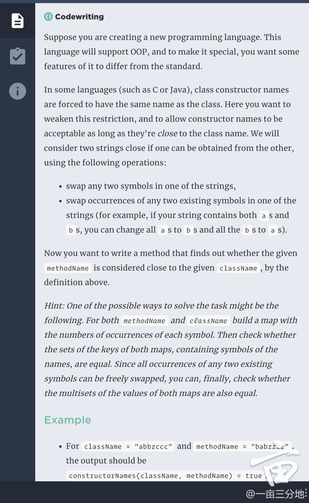
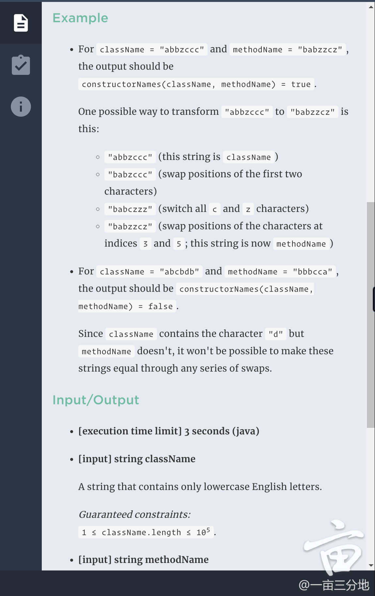
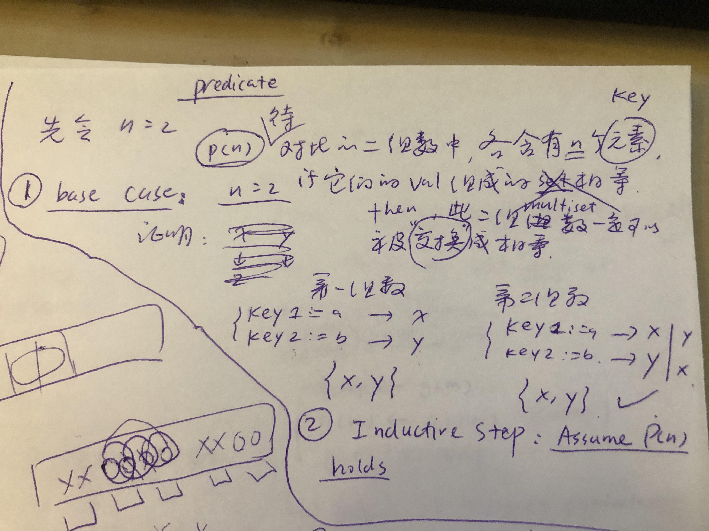
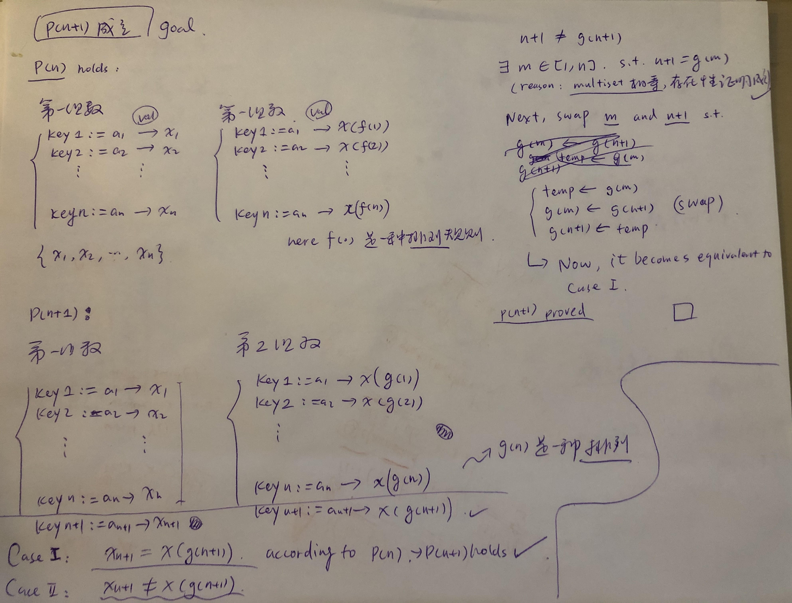

# Hash Table

## Type 1: Using Hash Table as Dictionary

### LeetCode 567: Permutation in String

Given two strings **s1** and **s2**, write a function to return true if **s2** contains the permutation of **s1**. In other words, one of the first string's permutations is the **substring** of the second string.

**Example 1:**

```text
Input: s1 = "ab" s2 = "eidbaooo"
Output: True
Explanation: s2 contains one permutation of s1 ("ba").
```

**Example 2:**

```text
Input:s1= "ab" s2 = "eidboaoo"
Output: False
```

**Note:**

1. The input strings only contain lower case letters.
2. The length of both given strings is in range \[1, 10,000\].

#### Logic:

* 先扫一遍字符串s1，统计各个字母的个数，取s2前s1长度个字符，匹配个数是否相符
* 若不相符，**去除最前面的字符，加入后一个字符**，重新比对，直至个数匹配，或扫描完s2。


#### Sample code:


```cpp
class Solution {
public:
    bool checkDict(vector<int>& dict)
    {
        for (int i = 0; i < 26; i++)
        {
            if (dict[i] != 0)
                return false;
        }
        return true;
    }

    bool checkInclusion(string s1, string s2) {
        int n1 = s1.size(), n2 = s2.size();
        if (n1 > n2)
            return false;
        vector<int> dict(26, 0);
        
        for (int i = 0; i < n1; i++)
        {
            dict[s1[i]-'a']++;
            dict[s2[i]-'a']--;
        }
        if (checkDict(dict))
            return true;
        
        for (int i = n1; i < n2; i++)
        {
            dict[s2[i-n1]-'a']++;
            dict[s2[i]-'a']--;
            if (checkDict(dict))
                return true;
        }
        
        return false;
    }
};
```


## Type 2: Multiset / Multimap

### A postmates OA question:





#### Logic:





