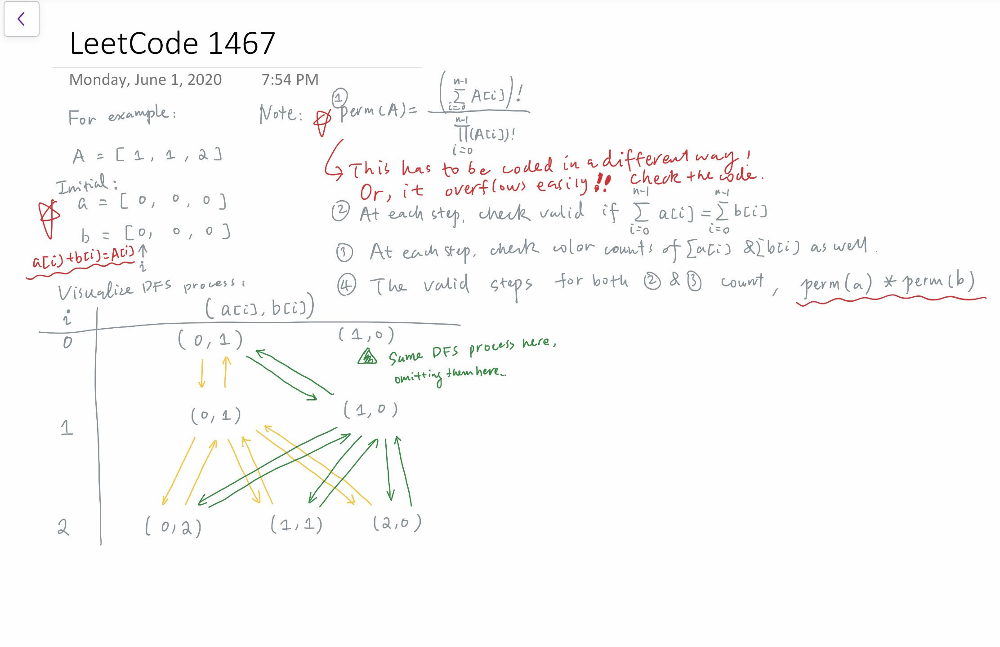

# Math Related Topics

## Type 1: Factors / GCD

### LintCode 235. Prime Factorization

Prime factorize a given integer.

**Example 1:**

```text
Input: 10
Output: [2, 5]
```

**Example 2:**

```text
Input: 660
Output: [2, 2, 3, 5, 11]
```

#### Logic:

* Simply loop `i` from  `2` to `sqrt(num)`
* Toward the end, the `res` vector shall store one more element, given the condition:
  * `if (res.size() == 0 || res.back() <= target)` or, more straightforward,
  * `if (target > 1)`

#### Sample code:


```cpp
class Solution {
public:
    /**
     * @param num: An integer
     * @return: an integer array
     */
    vector<int> primeFactorization(int num) {
        // write your code here
        int target = num;
        
        vector<int> res;
        for (int i = 2; i * i <= target; i++)
        {
            while (target % i == 0)
            {
                target /= i;
                res.push_back(i);
            }
        }
        if (res.size() == 0 || res.back() <= target)
            res.push_back(target);
        
        return res;
    }
};
```


## Type 2: Probability

### LeetCode 1467. Probability of a Two Boxes Having The Same Number of Distinct Balls

Given `2n` balls of `k` distinct colors. You will be given an integer array `balls` of size `k` where `balls[i]` is the number of balls of color `i`. 

All the balls will be **shuffled uniformly at random**, then we will distribute the first `n` balls to the first box and the remaining `n` balls to the other box \(Please read the explanation of the second example carefully\).

Please note that the two boxes are considered different. For example, if we have two balls of colors `a` and `b`, and two boxes `[]` and `()`, then the distribution `[a] (b)` is considered different than the distribution `[b] (a)` \(Please read the explanation of the first example carefully\).

We want to _calculate the probability_ that the two boxes have the same number of distinct balls.

**Example 1:**

```text
Input: balls = [1,1]
Output: 1.00000
Explanation: Only 2 ways to divide the balls equally:
- A ball of color 1 to box 1 and a ball of color 2 to box 2
- A ball of color 2 to box 1 and a ball of color 1 to box 2
In both ways, the number of distinct colors in each box is equal. The probability is 2/2 = 1
```

**Example 2:**

```text
Input: balls = [2,1,1]
Output: 0.66667
Explanation: We have the set of balls [1, 1, 2, 3]
This set of balls will be shuffled randomly and we may have one of the 12 distinct shuffles with equale probability (i.e. 1/12):
[1,1 / 2,3], [1,1 / 3,2], [1,2 / 1,3], [1,2 / 3,1], [1,3 / 1,2], [1,3 / 2,1], [2,1 / 1,3], [2,1 / 3,1], [2,3 / 1,1], [3,1 / 1,2], [3,1 / 2,1], [3,2 / 1,1]
After that we add the first two balls to the first box and the second two balls to the second box.
We can see that 8 of these 12 possible random distributions have the same number of distinct colors of balls in each box.
Probability is 8/12 = 0.66667
```

**Example 3:**

```text
Input: balls = [1,2,1,2]
Output: 0.60000
Explanation: The set of balls is [1, 2, 2, 3, 4, 4]. It is hard to display all the 180 possible random shuffles of this set but it is easy to check that 108 of them will have the same number of distinct colors in each box.
Probability = 108 / 180 = 0.6
```

**Example 4:**

```text
Input: balls = [3,2,1]
Output: 0.30000
Explanation: The set of balls is [1, 1, 1, 2, 2, 3]. It is hard to display all the 60 possible random shuffles of this set but it is easy to check that 18 of them will have the same number of distinct colors in each box.
Probability = 18 / 60 = 0.3
```

**Example 5:**

```text
Input: balls = [6,6,6,6,6,6]
Output: 0.90327
```

**Constraints:**

* `1 <= balls.length <= 8`
* `1 <= balls[i] <= 6`
* `sum(balls)` is even.
* Answers within `10^-5` of the actual value will be accepted as correct.

Logic:

* **Method 1: DFS**
  * Refer to [this page](https://leetcode.com/problems/probability-of-a-two-boxes-having-the-same-number-of-distinct-balls/discuss/661730/C%2B%2B-Backtrack-with-explanation) as reference
  * Need to calculating probability during the counting, otherwise it will easily get overwhelmed




```cpp
class Solution {
public:
    int sum_A = 0;
    
    double perm(vector<int>& A)
    {
        double ans = 1.0;
        for (int i = 0, j = 1; i < A.size(); i++) {
            for (int k = 1; k <= A[i]; j++, k++) ans = ans * j / k; // an important trick to avoid overflow
        }
        return ans;
    }
    
    double dfs(vector<int>& A, vector<int>& a, vector<int>& b, int sum_a, int sum_b, int i) {
        double ans = 0.0;
        if (sum_a > sum_A / 2 || sum_b > sum_A / 2) return 0.0; // invalid split because either `a` or `b` takes up more than half of the balls.
        if (i == A.size()) {
            int color_a = 0, color_b = 0;
            for (int j = 0; j < A.size(); j++) {
                color_a += a[j] > 0;
                color_b += b[j] > 0;
            }
            if (color_a != color_b) return 0.0; // invalid split because `a` and `b` don't have the same number of distinct colors.
            return perm(a) * perm(b);
        }
        
        for (int j = 0; j <= A[i]; j++) { // try different splits at the `i`-th element, i.e. a[i] + b[i] = A[i]
            a[i] = j;
            b[i] = A[i] - j;
            ans += dfs(A, a, b, sum_a + a[i], sum_b + b[i], i+1);
        }
        return ans;
    }
    double getProbability(vector<int>& balls) {
        sum_A = accumulate(begin(balls), end(balls), 0);
        vector<int> a(balls.size(), 0), b(balls.size(), 0);
        return dfs(balls, a, b, 0, 0, 0) / perm(balls); // finally need to divide overall permutations
    }
};
```


