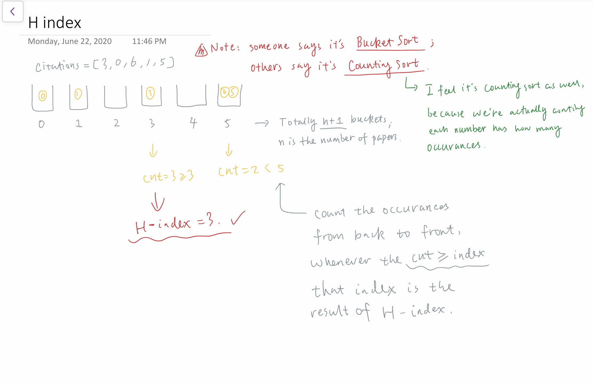

# Sort

## Type 1: Counting Sort

### LeetCode 274. H-Index

Given an array of citations \(each citation is a non-negative integer\) of a researcher, write a function to compute the researcher's h-index.

According to the [definition of h-index on Wikipedia](https://en.wikipedia.org/wiki/H-index): "A scientist has index h if h of his/her N papers have **at least** h citations each, and the other N − h papers have **no more than** h citations each."

**Example:**

```text
Input: citations = [3,0,6,1,5]
Output: 3 
Explanation: [3,0,6,1,5] means the researcher has 5 papers in total and each of them had 
             received 3, 0, 6, 1, 5 citations respectively. 
             Since the researcher has 3 papers with at least 3 citations each and the remaining 
             two with no more than 3 citations each, her h-index is 3.
```

**Note:** If there are several possible values for _h_, the maximum one is taken as the h-index.

#### Logic:

* Check the picture below




```cpp
class Solution {
public:
    int hIndex(vector<int>& citations) {
        // arrange each item into some "bucket" 
        // Note: it's actually NOT bucket sort but counting sort
        //       here we just use the "bucket" as a metaphore
        int n = citations.size();
        vector<int> bucket(n+1, 0);
        for (auto c : citations) {
            if (c >= n) bucket[n]++;
            else bucket[c]++;
        }
        
        // get h_index by comparing accumulative counts and the "bucket" id
        int cnt = 0;
        for (int i = n; i >= 0; i--) {
            cnt += bucket[i];
            if (cnt >= i) return i;
        }
        
        return 0;
    }
};
```


