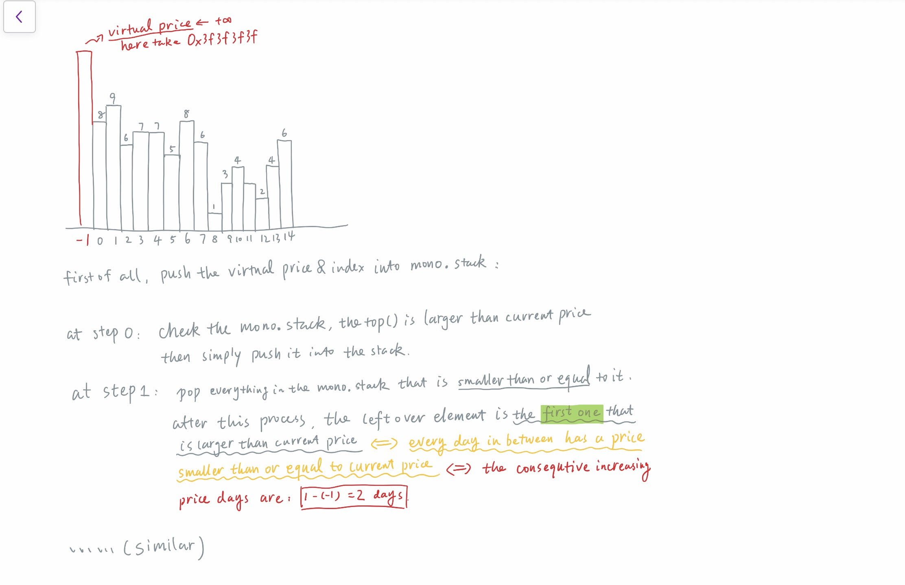

# Stack

## Type 1: Monotone Decreasing Stack

### LeetCode 901. Online Stock Span

Write a class `StockSpanner` which collects daily price quotes for some stock, and returns the _span_ of that stock's price for the current day.

The span of the stock's price today is defined as the maximum number of consecutive days \(starting from today and going backwards\) for which the price of the stock was less than or equal to today's price.

For example, if the price of a stock over the next 7 days were `[100, 80, 60, 70, 60, 75, 85]`, then the stock spans would be `[1, 1, 1, 2, 1, 4, 6]`.

**Example 1:**

```text
Input: ["StockSpanner","next","next","next","next","next","next","next"], [[],[100],[80],[60],[70],[60],[75],[85]]
Output: [null,1,1,1,2,1,4,6]
Explanation: 
First, S = StockSpanner() is initialized.  Then:
S.next(100) is called and returns 1,
S.next(80) is called and returns 1,
S.next(60) is called and returns 1,
S.next(70) is called and returns 2,
S.next(60) is called and returns 1,
S.next(75) is called and returns 4,
S.next(85) is called and returns 6.

Note that (for example) S.next(75) returned 4, because the last 4 prices
(including today's price of 75) were less than or equal to today's price.
```

**Note:**

1. Calls to `StockSpanner.next(int price)` will have `1 <= price <= 10^5`.
2. There will be at most `10000` calls to `StockSpanner.next` per test case.
3. There will be at most `150000` calls to `StockSpanner.next` across all test cases.
4. The total time limit for this problem has been reduced by 75% for C++, and 50% for all other languages.

#### Logic:

* The goal is equivalent to finding the _**Lowerbound**_ of current price!!!
* If the goal is related to lowerbound, then it is likely to be related to _**monotone stack**_!!!




```cpp
class StockSpanner {
public:
    int index;
    stack<int> mono_decr_price;
    stack<int> mono_decr_index;
    StockSpanner() {
        index = 0;
        mono_decr_price.push(0x3f3f3f3f);
        mono_decr_index.push(-1);
    }
    
    int next(int price) {
        while (mono_decr_price.size() > 0 && mono_decr_price.top() <= price)
        {
            mono_decr_price.pop();
            mono_decr_index.pop();
        }
        int lb = mono_decr_index.top();
        mono_decr_index.push(index++);
        mono_decr_price.push(price);
        return (index - 1) - lb;
    }
};

/**
 * Your StockSpanner object will be instantiated and called as such:
 * StockSpanner* obj = new StockSpanner();
 * int param_1 = obj->next(price);
 */
```


#### Related Problems:

* [1130. Minimum Cost Tree From Leaf Values](https://leetcode.com/problems/minimum-cost-tree-from-leaf-values/)
* [907. Sum of Subarray Minimums](https://leetcode.com/problems/sum-of-subarray-minimums/)
* [503. Next Greater Element II](https://leetcode.com/problems/next-greater-element-ii/)
* [1008. Construct Binary Search Tree From Preorder Traversal ](https://leetcode.com/problems/construct-binary-search-tree-from-preorder-traversal/)
  * [A solution in this gitbook](https://app.gitbook.com/@chenyus/s/leetcodedigest/~/drafts/-M88hAgbE5Dri_z7Nwwj/binary-tree#leetcode-1008-construct-binary-search-tree-from-preorder-traversal)


