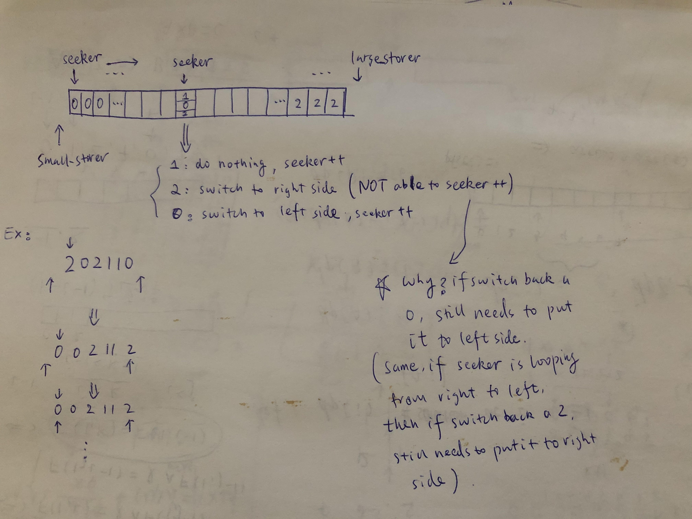
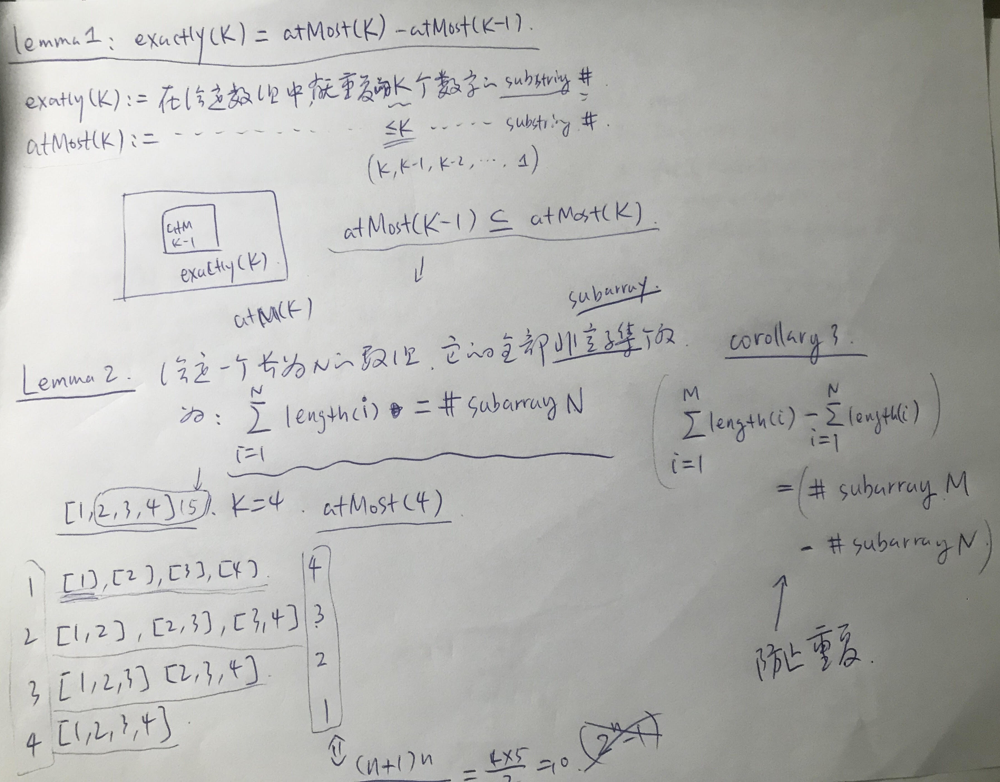
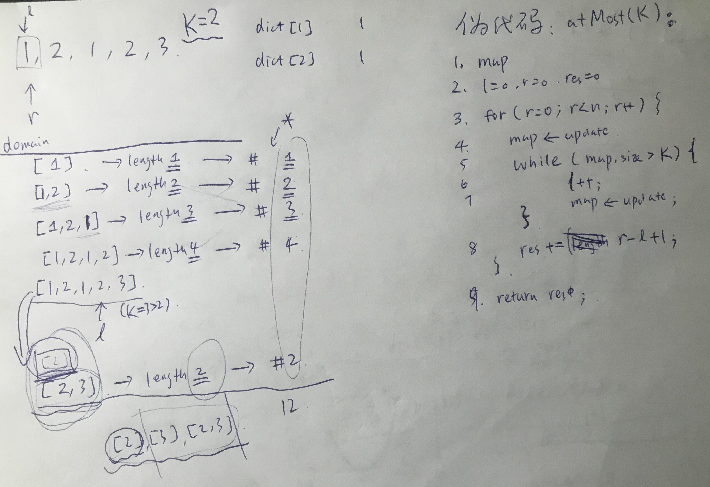

# Two Pointers

## Type 1: Partition

### LeetCode 75. Sort Colors

Given an array with _n_ objects colored red, white or blue, sort them [**in-place**](https://en.wikipedia.org/wiki/In-place_algorithm) ****so that objects of the same color are adjacent, with the colors in the order red, white and blue.

Here, we will use the integers 0, 1, and 2 to represent the color red, white, and blue respectively.

**Note:** You are not suppose to use the library's sort function for this problem.

**Example:**

```text
Input: [2,0,2,1,1,0]
Output: [0,0,1,1,2,2]
```

**Follow up:**

* A rather straight forward solution is a two-pass algorithm using counting sort. First, iterate the array counting number of 0's, 1's, and 2's, then overwrite array with total number of 0's, then 1's and followed by 2's.
* Could you come up with a one-pass algorithm using only constant space?

#### Logic:

* Check the picture below



#### Sample Code:


```cpp
class Solution {
public:
    void sortColors(vector<int>& nums) {
        int n = nums.size();
        int seeker = 0;
        int small_storer = -1, large_storer = n;
        
        while (seeker < large_storer) {
            if (nums[seeker] == 0) {
                swap(nums[++small_storer], nums[seeker++]); // only the small storer can ++, the large storer can not -- 
            } else if (nums[seeker] == 2) {
                swap(nums[--large_storer], nums[seeker]);
            } else seeker++; // if nums[seeker] == 1, do nothing
        }
    }
};
```


## Type 2: Opposite Two-pointers

### LeetCode 1498. Number of Subsequences That Satisfy the Given Sum Condition

Given an array of integers `nums` and an integer `target`.

Return the number of **non-empty** subsequences of `nums` such that the sum of the minimum and maximum element on it is less or equal than `target`.

Since the answer may be too large, return it modulo 10^9 + 7.

**Example 1:**

```text
Input: nums = [3,5,6,7], target = 9
Output: 4
Explanation: There are 4 subsequences that satisfy the condition.
[3] -> Min value + max value <= target (3 + 3 <= 9)
[3,5] -> (3 + 5 <= 9)
[3,5,6] -> (3 + 6 <= 9)
[3,6] -> (3 + 6 <= 9)
```

**Example 2:**

```text
Input: nums = [3,3,6,8], target = 10
Output: 6
Explanation: There are 6 subsequences that satisfy the condition. (nums can have repeated numbers).
[3] , [3] , [3,3], [3,6] , [3,6] , [3,3,6]
```

**Example 3:**

```text
Input: nums = [2,3,3,4,6,7], target = 12
Output: 61
Explanation: There are 63 non-empty subsequences, two of them don't satisfy the condition ([6,7], [7]).
Number of valid subsequences (63 - 2 = 61).
```

**Example 4:**

```text
Input: nums = [5,2,4,1,7,6,8], target = 16
Output: 127
Explanation: All non-empty subset satisfy the condition (2^7 - 1) = 127
```

**Constraints:**

* `1 <= nums.length <= 10^5`
* `1 <= nums[i] <= 10^6`
* `1 <= target <= 10^6`

#### Logic:

* Need to figure out this problem shall be solve by **opposite two-pointers** method
* Take care of the `getPowerOf2()` function, we must implement **binary search**, otherwise the time complexity will be so high that we get TLE on the OJ

#### Sample Code:


```cpp
class Solution {
private:
    long modulo = pow(10, 9) + 7;
    
    // Note: Need to use binary search to calculate power of 2 quickly, otherwise it will TLE
    long getPowerOf2(int n) {
        if (n == 0) return 1;
        long half = getPowerOf2(n/2);
        int rem = n % 2;
        return ( (half * half) % modulo * ((long)1 << rem) ) % modulo; 
    }
public:
    int numSubseq(vector<int>& nums, int target) {
        sort(nums.begin(), nums.end());
        int n = nums.size(), l = 0, r = n-1;
        long cnt = 0;
        
        while (l <= r) {
            if (nums[l] + nums[r] <= target) {
                cnt = (cnt + getPowerOf2(r-l)) % modulo;
                l++;
            } else {
                // use upper_bound to find the proper r (or... simply r--)
                int r_target = target - nums[l];
                auto ub = upper_bound(nums.begin() + l, nums.begin() + r, r_target);
                if (ub == nums.end()) break;
                r = ub - nums.begin() - 1;
            }
        }

        return cnt;        
    }
};
```


## Type 3: Same Direction Two-pointers / Sliding Window

### LeetCode 992: Subarrays with K Different Integers

Given an array `A` of positive integers, call a \(contiguous, not necessarily distinct\) subarray of `A` _good_ if the number of different integers in that subarray is exactly `K`.

\(For example, `[1,2,3,1,2]` has `3` different integers: `1`, `2`, and `3`.\)

Return the number of good subarrays of `A`.

**Example 1:**

```text
Input: A = [1,2,1,2,3], K = 2
Output: 7
Explanation: Subarrays formed with exactly 2 different integers: [1,2], [2,1], [1,2], [2,3], [1,2,1], [2,1,2], [1,2,1,2].
```

**Example 2:**

```text
Input: A = [1,2,1,3,4], K = 3
Output: 3
Explanation: Subarrays formed with exactly 3 different integers: [1,2,1,3], [2,1,3], [1,3,4].
```

**Note:**

1. `1 <= A.length <= 20000`
2. `1 <= A[i] <= A.length`
3. `1 <= K <= A.length`

#### Logic:

* Here are two of the most important points of this puzzle, which could also be useful at other puzzles \(check the following pictures for further details with brief proof\)
  * Convert the problem of counting **exactly** `K` ****distinct chars to counting **at least** `K` distinct chars
  * Convert the problem of counting subarray to counting sum of lengths of ranges






#### Sample Code:


```cpp
class Solution {
public:
    int atMost(vector<int>& A, int K) {
        int res = 0;
        int l = 0, r = 0, n = A.size();
        unordered_map<int, int> dict;
        for (int r = 0; r < n; r++) {
            if (dict[A[r]]++ == 0) K--;
            while (K < 0) {
                if (dict[A[l]]-- == 1) K++;
                l++;
            }
            res += r - l + 1;
        }
        
        return res;
    }
    int subarraysWithKDistinct(vector<int>& A, int K) {
        return atMost(A, K) - atMost(A, K-1);
    }
};
```


